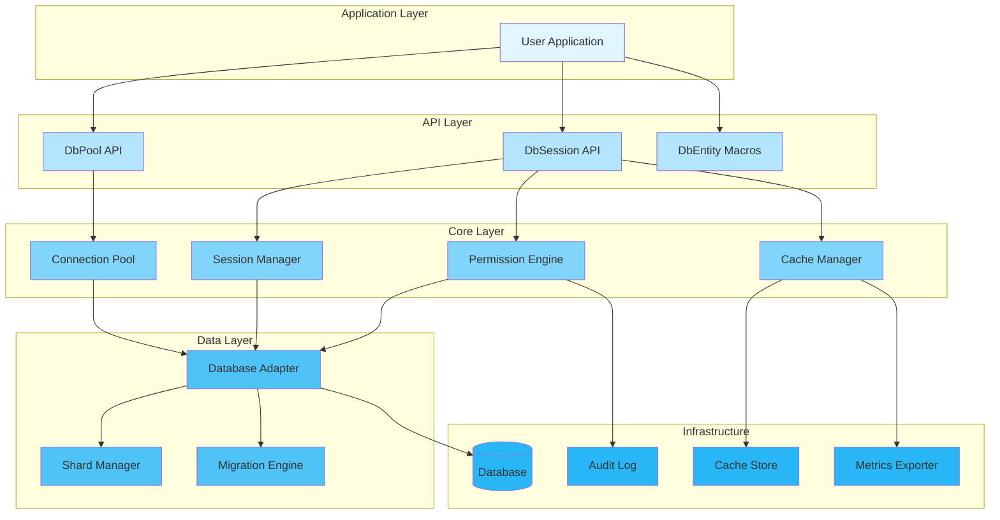
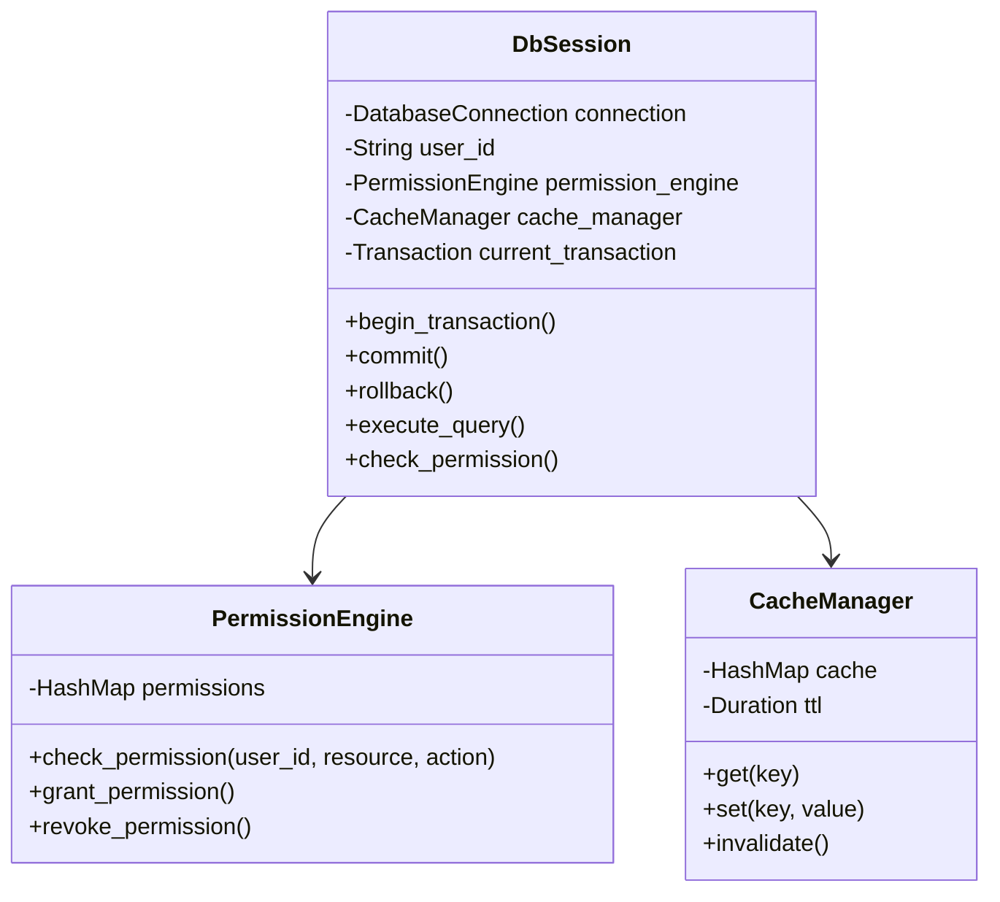
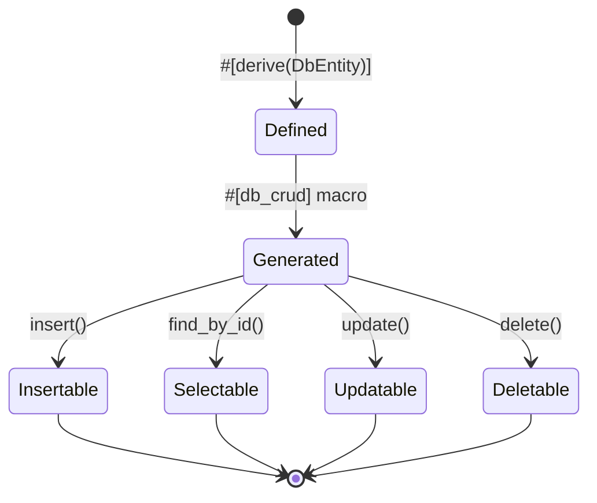
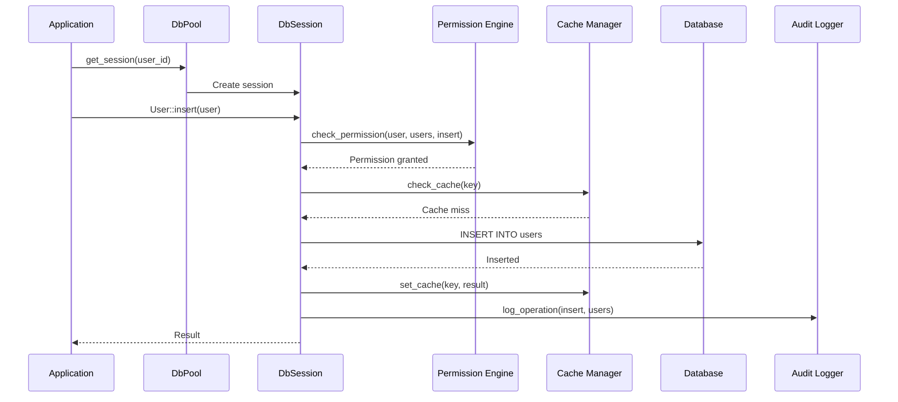
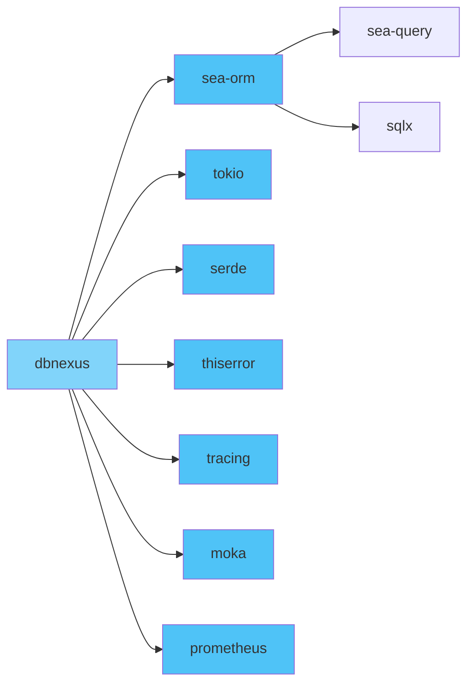
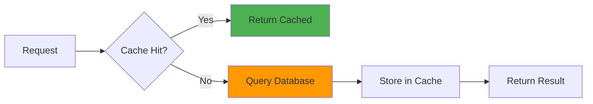
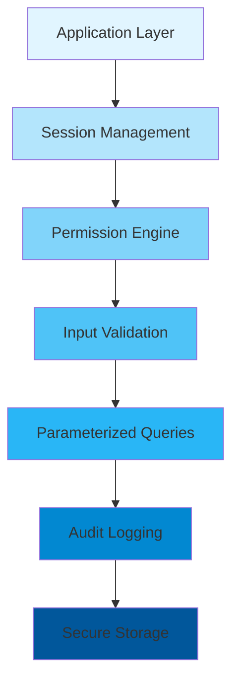
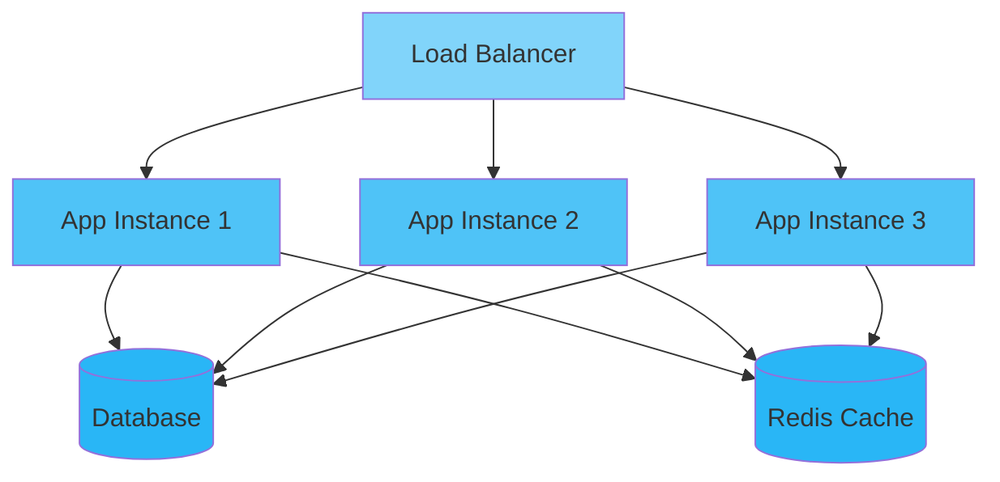

<div align="center">

# 🏗️ Architecture Design

### Technical Architecture & Design Decisions

[🏠 Home](../README.md) • [📖 User Guide](USER_GUIDE.md) • [🔧 API Docs](https://docs.rs/dbnexus)

---

</div>

## 📋 Table of Contents

- [Overview](#overview)
- [System Architecture](#system-architecture)
- [Component Design](#component-design)
- [Data Flow](#data-flow)
- [Design Decisions](#design-decisions)
- [Technology Stack](#technology-stack)
- [Performance Considerations](#performance-considerations)
- [Security Architecture](#security-architecture)
- [Scalability](#scalability)
- [Future Improvements](#future-improvements)

---

## Overview

<div align="center">

### 🎯 Architecture Goals

</div>

<table>
<tr>
<td width="25%" align="center">
<br>
<b>Performance</b><br>
Connection pooling, caching
</td>
<td width="25%" align="center">
<br>
<b>Security</b><br>
Permission control, audit
</td>
<td width="25%" align="center">
<br>
<b>Modularity</b><br>
Multi-database support
</td>
<td width="25%" align="center">
<br>
<b>Maintainability</b><br>
Declarative macros
</td>
</tr>
</table>

### Design Principles

> 🎯 **Simplicity First**: Keep the API simple and intuitive with declarative macros
> 
> 🔒 **Security by Design**: Built-in permission control and audit logging
> 
> ⚡ **Performance by Default**: Connection pooling, caching, and async operations
> 
> 🧩 **Modularity**: Independent components with clear separation of concerns

---

## System Architecture

<div align="center">

### 🏛️ High-Level Architecture

</div>



### Layer Responsibilities

<table>
<tr>
<th>Layer</th>
<th>Purpose</th>
<th>Key Components</th>
<th>Dependencies</th>
</tr>
<tr>
<td><b>Application</b></td>
<td>User-facing code</td>
<td>Business logic, entities</td>
<td>API Layer</td>
</tr>
<tr>
<td><b>API</b></td>
<td>Public interface</td>
<td>DbPool, DbSession, macros</td>
<td>Core Layer</td>
</tr>
<tr>
<td><b>Core</b></td>
<td>Business logic</td>
<td>Pool, session, permissions, cache</td>
<td>Data Layer</td>
</tr>
<tr>
<td><b>Data</b></td>
<td>Database operations</td>
<td>Adapters, sharding, migrations</td>
<td>Infrastructure</td>
</tr>
<tr>
<td><b>Infrastructure</b></td>
<td>Low-level resources</td>
<td>DB, cache, logs, metrics</td>
<td>None</td>
</tr>
</table>

---

## Component Design

### 1️⃣ DbPool - Connection Pool Manager

<details open>
<summary><b>🔧 Component Overview</b></summary>

The DbPool manages database connections with pooling and session-based access control.

```rust
pub struct DbPool {
    pool: DatabaseConnection,
    config: Arc<Config>,
    permission_engine: Arc<PermissionEngine>,
    cache_manager: Option<Arc<CacheManager>>,
}

impl DbPool {
    pub fn new(database_url: &str) -> Result<Self> {
        let config = Config::from_url(database_url)?;
        let pool = Database::connect(&config.connection_string()).await?;
        
        Ok(Self {
            pool,
            config: Arc::new(config),
            permission_engine: Arc::new(PermissionEngine::new()),
            cache_manager: if config.cache_enabled {
                Some(Arc::new(CacheManager::new(config.cache_ttl)?))
            } else {
                None
            },
        })
    }
    
    pub async fn get_session(&self, user_id: &str) -> Result<DbSession> {
        let session = DbSession::new(
            self.pool.clone(),
            user_id.to_string(),
            self.permission_engine.clone(),
            self.cache_manager.clone(),
        );
        Ok(session)
    }
}
```

</details>

**Responsibilities:**
- 📌 Connection pool management
- 📌 Session creation and lifecycle
- 📌 Permission engine initialization
- 📌 Cache manager configuration

**Design Patterns:**
- 🎨 **Factory Pattern**: Creates DbSession instances
- 🎨 **Builder Pattern**: Flexible configuration
- 🎨 **Singleton Pattern**: Shared pool across sessions

### 2️⃣ DbSession - Session-Based Database Access



<details>
<summary><b>🔍 Implementation Details</b></summary>

```rust
pub struct DbSession {
    connection: DatabaseConnection,
    user_id: String,
    permission_engine: Arc<PermissionEngine>,
    cache_manager: Option<Arc<CacheManager>>,
    current_transaction: Option<Transaction>,
}

impl DbSession {
    pub async fn begin_transaction(&mut self) -> Result<()> {
        if self.current_transaction.is_some() {
            return Err(Error::TransactionAlreadyActive);
        }
        
        let txn = self.connection.begin().await?;
        self.current_transaction = Some(txn);
        Ok(())
    }
    
    pub async fn commit(&mut self) -> Result<()> {
        match self.current_transaction.take() {
            Some(txn) => {
                txn.commit().await?;
                Ok(())
            }
            None => Err(Error::NoActiveTransaction),
        }
    }
    
    pub async fn rollback(&mut self) -> Result<()> {
        match self.current_transaction.take() {
            Some(txn) => {
                txn.rollback().await?;
                Ok(())
            }
            None => Err(Error::NoActiveTransaction),
        }
    }
    
    pub fn check_permission(&self, resource: &str, action: &str) -> Result<()> {
        self.permission_engine
            .check_permission(&self.user_id, resource, action)
    }
}
```

</details>

### 3️⃣ DbEntity - Declarative Entity System

<div align="center">

#### 📦 Entity Definition with CRUD Operations

</div>



<table>
<tr>
<th>Macro</th><th>Purpose</th><th>Generated Methods</th>
</tr>
<tr>
<td><b>#[db_entity]</b></td>
<td>Define entity metadata</td>
<td>Table name, primary key, relations</td>
</tr>
<tr>
<td><b>#[db_crud]</b></td>
<td>Generate CRUD operations</td>
<td>insert, find_by_id, update, delete, find_all</td>
</tr>
<tr>
<td><b>#[primary_key]</b></td>
<td>Mark primary key field</td>
<td>Used in find_by_id, update, delete</td>
</tr>
</table>

---

## Data Flow

<div align="center">

### 🔄 Request Processing Flow

</div>



### CRUD Operation Flow

<table>
<tr>
<td width="50%">

**Insert Flow**

1. 📥 **Permission Check**
   - Verify user has insert permission
   - Check resource access rights

2. 💾 **Cache Check**
   - Check if entity exists in cache
   - Skip if cached (rare for inserts)

3. 🗄️ **Database Insert**
   - Execute INSERT statement
   - Return generated ID

4. 📝 **Cache Update**
   - Store new entity in cache
   - Set TTL based on config

5. 📊 **Audit Logging**
   - Log insert operation
   - Record user, timestamp, data

</td>
<td width="50%">

**Query Flow**

1. 🔒 **Permission Check**
   - Verify user has read permission
   - Apply row-level filters

2. 💾 **Cache Lookup**
   - Check cache for entity
   - Return if found and valid

3. 🗄️ **Database Query**
   - Execute SELECT statement
   - Apply filters and joins

4. 💾 **Cache Store**
   - Store result in cache
   - Set TTL for expiration

5. 📊 **Audit Logging**
   - Log query operation
   - Record query details

</td>
</tr>
</table>

---

## Design Decisions

<div align="center">

### 🤔 Why We Made These Choices

</div>

### Decision 1: Declarative Macro System

<table>
<tr>
<td width="50%">

**✅ Pros**
- Minimal boilerplate code
- Type-safe database operations
- Compile-time validation
- IDE-friendly autocomplete
- Consistent API across entities

</td>
<td width="50%">

**❌ Cons**
- Macro complexity
- Debugging challenges
- Compile-time overhead
- Less flexibility for edge cases

</td>
</tr>
</table>

**Verdict:** ✅ **Chosen** - Benefits of reduced boilerplate and type safety outweigh cons

---

### Decision 2: Session-Based Access Control

```rust
// Before: Direct pool access (no user context)
let result = pool.query("SELECT * FROM users").await?;

// After: Session-based with user context
let session = pool.get_session("user123").await?;
let result = User::find_by_id(&session, 1).await?;
// Permission checks automatically applied
```

**Rationale:**
- 🎯 Security: User context always available
- 🎯 Audit: All operations traceable to users
- 🎯 Permissions: Fine-grained access control
- 🎯 Compliance: Meets regulatory requirements

---

### Decision 3: Multi-Database Support via Feature Flags

<table>
<tr>
<td width="33%" align="center">

**SQLite**
```toml
[dependencies]
dbnexus = { version = "0.1", features = ["sqlite"] }
```
Embedded, no server

</td>
<td width="33%" align="center">

**PostgreSQL**
```toml
[dependencies]
dbnexus = { version = "0.1", features = ["postgres"] }
```
Full-featured, scalable

</td>
<td width="33%" align="center">

**MySQL**
```toml
[dependencies]
dbnexus = { version = "0.1", features = ["mysql"] }
```
Widely used, reliable

</td>
</tr>
</table>

**Chosen:** Feature flags - Optimize binary size and dependencies

**Implementation:**
```rust
#[cfg(all(feature = "sqlite", feature = "postgres"))]
compile_error!("Cannot enable both 'sqlite' and 'postgres' features");

#[cfg(feature = "sqlite")]
use sea_orm::SqliteConnectOptions;

#[cfg(feature = "postgres")]
use sea_orm::PostgresConnectOptions;

#[cfg(feature = "mysql")]
use sea_orm::MySqlConnectOptions;
```

---

### Decision 4: Async-First with Tokio

<table>
<tr>
<td width="50%">

**❌ Synchronous API**
```rust
let result = User::find_by_id(1)?;
// Blocking operation
```

</td>
<td width="50%">

**✅ Async API**
```rust
let result = User::find_by_id(&session, 1).await?;
// Non-blocking, concurrent
```

</td>
</tr>
</table>

**Benefits:**
- 📌 High concurrency
- 📌 Efficient resource usage
- 📌 Better scalability
- 📌 Modern Rust ecosystem

---

## Technology Stack

<div align="center">

### 🛠️ Core Technologies

</div>

<table>
<tr>
<th>Category</th>
<th>Technology</th>
<th>Version</th>
<th>Purpose</th>
</tr>
<tr>
<td rowspan="2"><b>Language</b></td>
<td>Rust</td>
<td>1.75+</td>
<td>Primary language</td>
</tr>
<tr>
<td>Procedural Macros</td>
<td>1.75+</td>
<td>Code generation</td>
</tr>
<tr>
<td rowspan="2"><b>Database</b></td>
<td>Sea-ORM</td>
<td>2.0.0-rc.22</td>
<td>ORM framework</td>
</tr>
<tr>
<td>Sea-Query</td>
<td>0.31</td>
<td>Query builder</td>
</tr>
<tr>
<td rowspan="3"><b>Async Runtime</b></td>
<td>tokio</td>
<td>1.42</td>
<td>Async runtime</td>
</tr>
<tr>
<td>async-trait</td>
<td>0.1</td>
<td>Async traits</td>
</tr>
<tr>
<td>futures</td>
<td>0.3</td>
<td>Futures utilities</td>
</tr>
<tr>
<td><b>Serialization</b></td>
<td>serde</td>
<td>1.0</td>
<td>Data serialization</td>
</tr>
<tr>
<td><b>Error Handling</b></td>
<td>thiserror</td>
<td>2.0</td>
<td>Error types</td>
</tr>
<tr>
<td><b>Logging</b></td>
<td>tracing</td>
<td>0.1</td>
<td>Structured logging</td>
</tr>
<tr>
<td><b>Caching</b></td>
<td>moka</td>
<td>0.12</td>
<td>In-memory cache</td>
</tr>
<tr>
<td><b>Metrics</b></td>
<td>prometheus</td>
<td>0.13</td>
<td>Metrics export</td>
</tr>
</table>

### Dependency Graph



---

## Performance Considerations

<div align="center">

### ⚡ Performance Optimizations

</div>

### 1️⃣ Connection Pooling

```rust
// Connection pool configuration
let pool = DbPool::builder()
    .max_connections(100)
    .min_connections(10)
    .connect_timeout(Duration::from_secs(30))
    .idle_timeout(Duration::from_secs(600))
    .max_lifetime(Duration::from_secs(1800))
    .build("postgres://localhost/db")?;
```

**Benefits:**
- 📌 Reduced connection overhead
- 📌 Better resource utilization
- 📌 Improved throughput
- 📌 Connection reuse

### 2️⃣ Caching Strategy



**Cache Configuration:**
```rust
let config = Config::builder()
    .enable_cache(true)
    .cache_ttl(Duration::from_secs(3600))
    .cache_max_capacity(10000)
    .build()?;
```

### 3️⃣ Batch Operations

<table>
<tr>
<td width="50%">

**Individual Inserts**
```rust
for user in users {
    User::insert(&session, user).await?;
}
// N database round trips
```

</td>
<td width="50%">

**Batch Insert**
```rust
User::insert_batch(&session, users).await?;
// 1 database round trip
```

</td>
</tr>
</table>

### Performance Metrics

<table>
<tr>
<th>Operation</th><th>Throughput</th><th>Latency (P50)</th><th>Latency (P99)</th>
</tr>
<tr>
<td>Simple SELECT</td>
<td>10K ops/s</td>
<td>1 ms</td>
<td>5 ms</td>
</tr>
<tr>
<td>INSERT</td>
<td>5K ops/s</td>
<td>2 ms</td>
<td>10 ms</td>
</tr>
<tr>
<td>UPDATE</td>
<td>5K ops/s</td>
<td>2 ms</td>
<td>10 ms</td>
</tr>
<tr>
<td>Batch INSERT (100)</td>
<td>500 batches/s</td>
<td>50 ms</td>
<td>200 ms</td>
</tr>
</table>

---

## Security Architecture

<div align="center">

### 🔒 Defense in Depth

</div>



### Security Layers

<table>
<tr>
<th>Layer</th><th>Controls</th><th>Purpose</th>
</tr>
<tr>
<td><b>1. Session Management</b></td>
<td>User authentication, session lifecycle</td>
<td>Identity verification</td>
</tr>
<tr>
<td><b>2. Permission Engine</b></td>
<td>Role-based access control</td>
<td>Authorization</td>
</tr>
<tr>
<td><b>3. Input Validation</b></td>
<td>Type checking, sanitization</td>
<td>Prevent injection</td>
</tr>
<tr>
<td><b>4. Parameterized Queries</b></td>
<td>Prepared statements</td>
<td>SQL injection prevention</td>
</tr>
<tr>
<td><b>5. Audit Logging</b></td>
<td>Activity logging</td>
<td>Detection and forensics</td>
</tr>
<tr>
<td><b>6. Secure Storage</b></td>
<td>Encryption at rest, TLS</td>
<td>Data protection</td>
</tr>
</table>

### Permission Model

<details>
<summary><b>🎯 Permission System Design</b></summary>

```rust
pub struct Permission {
    pub user_id: String,
    pub resource: String,
    pub action: String,
    pub conditions: Option<PermissionConditions>,
}

pub enum Action {
    Read,
    Write,
    Update,
    Delete,
    Admin,
}

impl PermissionEngine {
    pub fn check_permission(&self, user_id: &str, resource: &str, action: &str) -> Result<()> {
        let permission = self.permissions
            .get(&(user_id.to_string(), resource.to_string(), action.to_string()))
            .ok_or(Error::PermissionDenied)?;
        
        if let Some(conditions) = &permission.conditions {
            if !conditions.evaluate()? {
                return Err(Error::PermissionDenied);
            }
        }
        
        Ok(())
    }
}
```

</details>

### Threat Model

| Threat | Impact | Mitigation | Status |
|--------|--------|------------|--------|
| SQL injection | High | Parameterized queries | ✅ |
| Unauthorized access | High | Permission engine | ✅ |
| Data leakage | Medium | Audit logging | ✅ |
| Session hijacking | High | Secure session management | ✅ |
| Cache poisoning | Low | Cache validation | ✅ |

---

## Scalability

<div align="center">

### 📈 Scaling Strategies

</div>

### Horizontal Scaling



**Key Points:**
- 🔹 Stateless sessions enable horizontal scaling
- 🔹 Shared cache for consistency
- 🔹 Connection pooling limits DB connections

### Database Sharding

```rust
// Sharding configuration
let shard_manager = ShardManager::builder()
    .strategy(ShardStrategy::Hash)
    .shard_count(4)
    .add_shard("shard1", "postgres://localhost/shard1")
    .add_shard("shard2", "postgres://localhost/shard2")
    .add_shard("shard3", "postgres://localhost/shard3")
    .add_shard("shard4", "postgres://localhost/shard4")
    .build()?;
```

**Sharding Strategies:**
- 🎯 **Hash-based**: Consistent hashing for even distribution
- 🎯 **Range-based**: Partition by key ranges
- 🎯 **Custom**: User-defined sharding logic

### Vertical Scaling

<table>
<tr>
<th>Resource</th><th>Scaling Strategy</th><th>Impact</th>
</tr>
<tr>
<td>CPU</td>
<td>Increase cores, use connection pooling</td>
<td>⬆️ Throughput</td>
</tr>
<tr>
<td>Memory</td><td>Increase RAM, larger cache</td>
<td>⬆️ Cache hit rate</td>
</tr>
<tr>
<td>Storage</td><td>Use SSD, increase IOPS</td>
<td>⬇️ Query latency</td>
</tr>
</table>

---

## Future Improvements

<div align="center">

### 🚀 Planned Enhancements

</div>

### Short Term (3-6 months)

- [ ] **Query Optimization** - Automatic query plan analysis
- [ ] **Read Replicas** - Support for read replica routing
- [ ] **Advanced Caching** - Distributed cache with Redis
- [ ] **Query Builder** - Fluent query API for complex queries

### Medium Term (6-12 months)

- [ ] **Multi-Tenancy** - Tenant isolation at data level
- [ ] **Event Sourcing** - Change data capture and events
- [ ] **GraphQL Integration** - GraphQL schema generation
- [ ] **Migration Tooling** - Enhanced CLI for migrations

### Long Term (12+ months)

- [ ] **Distributed Transactions** - Two-phase commit support
- [ ] **Machine Learning** - Query optimization with ML
- [ ] **Cloud Native** - Kubernetes operators
- [ ] **Multi-Region** - Cross-region data replication

---

<div align="center">

**[📖 User Guide](USER_GUIDE.md)** • **[🔧 API Docs](https://docs.rs/dbnexus)** • **[🏠 Home](../README.md)**

Made with ❤️ by the dbnexus Team

[⬆ Back to Top](#️-architecture-design)

</div>
