# DBNexus Architecture

## Table of Contents

- [Overview](#overview)
- [Design Principles](#design-principles)
- [System Architecture](#system-architecture)
- [Module Architecture](#module-architecture)
- [Core Components](#core-components)
- [Data Flow](#data-flow)
- [Security Architecture](#security-architecture)
- [Performance Architecture](#performance-architecture)
- [Scalability Architecture](#scalability-architecture)

---

## Overview

DBNexus is an enterprise-grade database abstraction layer built on top of Sea-ORM. The architecture follows a **layered design** with clear separation of concerns, enabling developers to choose exactly the features they need through feature gates.

### Key Architectural Goals

1. **Modularity** - Feature-gated compilation for minimal binaries
2. **Safety** - RAII-based resource management and compile-time guarantees
3. **Performance** - Async-first design with efficient connection pooling
4. **Extensibility** - Pluggable components (permission engines, cache strategies)
5. **Observability** - Built-in metrics and audit logging (optional features)

---

## Design Principles

### 1. RAII Resource Management

All database connections are managed using Rust's RAII (Resource Acquisition Is Initialization) pattern:

```rust
{
    let session = pool.get_session("admin").await?;
    // Use session...
    // Connection automatically released when session is dropped
}
```

**Benefits:**
- Automatic connection cleanup
- No manual resource management needed
- Exception-safe guarantee

### 2. Feature-Gated Architecture

Features are organized into logical groups and enabled at compile time:

**Core Features (always available):**
- Connection pooling with RAII management
- Basic configuration management
- Database driver selection (SQLite, PostgreSQL, MySQL)

**Optional Core Features:**
- `permission` - Role-based access control
- `sql-parser` - SQL parsing for permission checks
- `macros` - Procedural macros for code generation

**Enterprise Features (optional):**
- `metrics` - Prometheus metrics collection
- `tracing` - OpenTelemetry integration
- `audit` - Comprehensive audit logging
- `migration` - Database migration management
- `sharding` - Data sharding support
- `cache` - LRU caching layer

### 3. Async-First Design

All I/O operations use `async/await` with Tokio:

- `AsyncMutex` for thread-safe state
- `Notify` for efficient condition waiting
- `tokio::spawn` for background tasks

### 4. Type-Safe Abstractions

Compile-time guarantees prevent common errors:

- **Database Driver Mutual Exclusion**: Only one database driver can be enabled
- **Permission Verification**: Compile-time role validation
- **Type Safety**: All database operations are type-safe

---

## System Architecture

### High-Level Layer Diagram

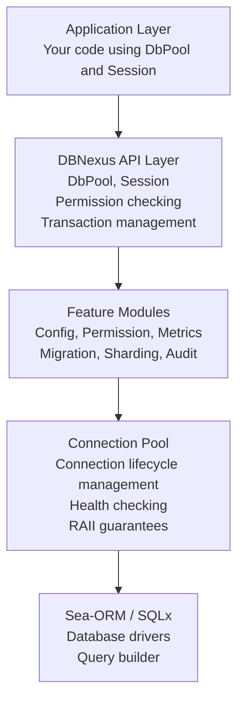
```mermaid
graph TD
    A[Application Layer<br/>Your code using DbPool and Session] --> B[DBNexus API Layer<br/>DbPool, Session<br/>Permission checking<br/>Transaction management]
    B --> C[Feature Modules<br/>Config, Permission, Metrics<br/>Migration, Sharding, Audit]
    C --> D[Connection Pool<br/>Connection lifecycle management<br/>Health checking<br/>RAII guarantees]
    D --> E[Sea-ORM / SQLx<br/>Database drivers<br/>Query builder]
```

### Component Interaction Flow

1. **Application** requests a session from `DbPool` with a specific role
2. **DbPool** validates the role and creates a `Session` with database connection
3. **Session** handles all database operations with automatic permission checking
4. **Permission System** validates table access based on role policies
5. **Connection** is automatically returned to pool when session is dropped

### Key Implementation Details

- **Connection Pool**: Uses `AsyncMutex<Vec<DatabaseConnection>>` with atomic counters
- **Permission Caching**: LRU cache for role policies to improve performance
- **Health Checking**: Background task validates idle connections periodically
- **RAII Management**: Connections automatically released on session drop

---

## Module Architecture

### Core Modules

#### 1. Configuration Module (`config.rs`)

**Responsibility:** Centralized configuration management

**Key Components:**
```rust
pub struct DbConfig {
    pub url: String,                    // Database connection URL
    pub max_connections: u32,           // Maximum pool size
    pub min_connections: u32,           // Minimum pool size
    pub idle_timeout: u64,              // Idle connection timeout
    pub acquire_timeout: u64,           // Connection acquisition timeout
    pub permissions_path: Option<String>, // Permission config path
    pub migrations_dir: Option<PathBuf>, // Migration directory
    pub auto_migrate: bool,             // Auto-migrate flag
    pub migration_timeout: u64,         // Migration timeout
    pub admin_role: String,             // Admin role name
}

pub struct DbConfigBuilder {
    // Chain API for building config
}

pub struct ConfigLoader {
    // Load from env vars, YAML, TOML
}

pub struct ConfigCorrector {
    // Auto-correct invalid values
}
```

**Configuration Sources Priority:**
1. Environment variables (highest)
2. YAML/TOML config files
3. Built-in defaults (lowest)

**Security Features:**
- Path traversal attack prevention
- URL protocol whitelist
- Configuration validation

#### 2. Connection Pool Module (`pool/`)

**Responsibility:** Manage database connection lifecycle

**Architecture:**

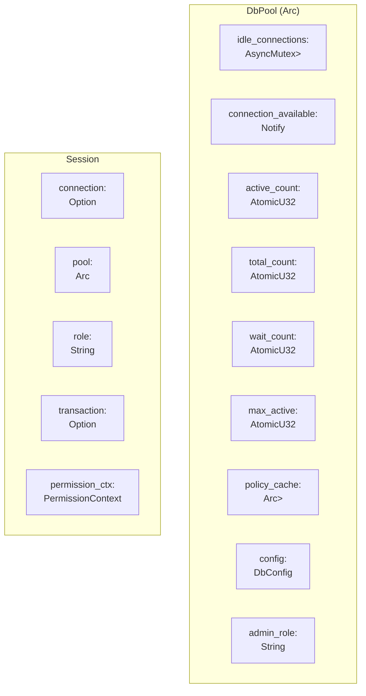
```mermaid
graph TD
    subgraph DbPool["DbPool (Arc<DbPoolInner>)"]
        idle_connections["idle_connections:<br/>AsyncMutex<Vec<DatabaseConnection>>"]
        connection_available["connection_available:<br/>Notify"]
        active_count["active_count:<br/>AtomicU32"]
        total_count["total_count:<br/>AtomicU32"]
        wait_count["wait_count:<br/>AtomicU32"]
        max_active["max_active:<br/>AtomicU32"]
        policy_cache["policy_cache:<br/>Arc<AsyncMutex<LruCache>>"]
        config["config:<br/>DbConfig"]
        admin_role["admin_role:<br/>String"]
    end

    subgraph Session["Session"]
        connection["connection:<br/>Option<DatabaseConnection>"]
        pool["pool:<br/>Arc<DbPool>"]
        role["role:<br/>String"]
        transaction["transaction:<br/>Option<DatabaseTransaction>"]
        permission_ctx["permission_ctx:<br/>PermissionContext"]
    end
```

**Connection Acquisition Flow:**

```rust
async fn acquire_connection(&self) -> DbResult<DatabaseConnection> {
    // 1. Try to get from idle queue
    let mut idle = self.idle_connections.lock().await;
    if let Some(conn) = idle.pop() {
        self.active_count.fetch_add(1, Ordering::SeqCst);
        return Ok(conn);
    }

    // 2. Check if max connections reached
    if self.total_count.load(Ordering::SeqCst) >= self.config.max_connections {
        drop(idle);
        self.wait_count.fetch_add(1, Ordering::SeqCst);
        let notified = self.connection_available.notified();
        notified.await; // Wait efficiently using Notify
        // Retry...
    }

    // 3. Create new connection
    let conn = self.create_connection().await?;
    self.total_count.fetch_add(1, Ordering::SeqCst);
    return Ok(conn);
}
```

**RAII Implementation:**

```rust
impl Drop for Session {
    fn drop(&mut self) {
        if let Some(conn) = self.connection.take() {
            self.pool.release_connection(conn);
        }
    }
}
```

#### 3. Permission Module (`permission.rs`)

**Responsibility:** Role-based access control (RBAC)

**Architecture:**

```
PermissionContext
├── role: String
├── policy_cache: Arc<AsyncMutex<LruCache<String, RolePolicy>>>
├── rate_limiter: Option<Arc<RateLimiter>>
└── config: PermissionConfig

PermissionConfig
└── roles: HashMap<String, RolePolicy>

RolePolicy
└── tables: Vec<TablePermission>

TablePermission
├── name: String (table name or "*")
└── operations: HashSet<PermissionAction>
```

**Permission Check Flow:**

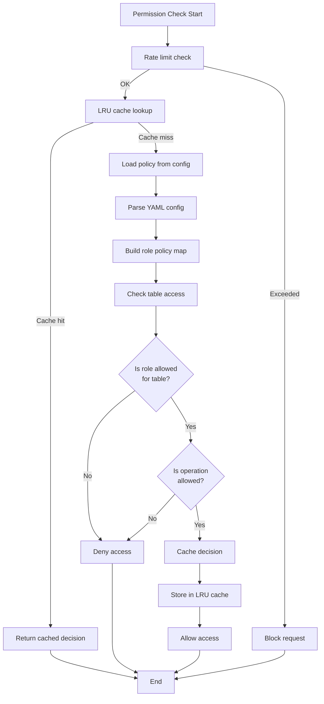
```mermaid
flowchart TD
    Start[Permission Check Start] --> RateLimit[Rate limit check]
    RateLimit -->|Exceeded| Block[Block request]
    RateLimit -->|OK| CacheLookup[LRU cache lookup]

    CacheLookup -->|Cache hit| ReturnCached[Return cached decision]
    CacheLookup -->|Cache miss| LoadPolicy[Load policy from config]

    LoadPolicy --> ParseYAML[Parse YAML config]
    ParseYAML --> BuildPolicy[Build role policy map]
    BuildPolicy --> CheckTable[Check table access]

    CheckTable --> CheckRole{Is role allowed<br/>for table?}
    CheckRole -->|No| Deny[Deny access]
    CheckRole -->|Yes| CheckOp{Is operation<br/>allowed?}

    CheckOp -->|No| Deny
    CheckOp -->|Yes| CacheDecision[Cache decision]

    CacheDecision --> StoreCache[Store in LRU cache]
    StoreCache --> Allow[Allow access]

    ReturnCached --> End[End]
    Deny --> End
    Allow --> End
    Block --> End
```

**Performance Optimizations:**

- **LRU Cache**: Default 256 entries, reduces config loading
- **Rate Limiting**: 100 requests/minute, prevents abuse
- **Async Locks**: Non-blocking for concurrent requests

### Optional Feature Modules

#### 4. Metrics Module (`metrics.rs`)

**Responsibility:** Performance metrics collection

**Metrics Tracked:**

| Metric | Description |
|---------|-------------|
| `pool_connections_active` | Currently active connections |
| `pool_connections_idle` | Idle connections |
| `pool_connections_total` | Total connections |
| `query_latency_p50` | 50th percentile latency |
| `query_latency_p99` | 99th percentile latency |
| `query_throughput` | Queries per second |

**Data Structures:**

```rust
pub struct MetricsCollector {
    latency_histogram: LatencyHistogram,
    latency_percentiles: LatencyPercentiles,
    query_counter: AtomicU64,
    error_counter: AtomicU64,
}

pub struct LatencyPercentiles {
    p50: AtomicU64,
    p90: AtomicU64,
    p95: AtomicU64,
    p99: AtomicU64,
    p99_9: AtomicU64,
}
```

#### 5. Audit Module (`audit.rs`)

**Responsibility:** Complete operation audit trail

**Audit Event Structure:**

```rust
pub struct AuditEvent {
    pub event_id: Uuid,
    pub timestamp: DateTime<Utc>,
    pub operation: AuditOperation,
    pub severity: AuditSeverity,
    pub result: AuditResult,
    pub table_name: Option<String>,
    pub record_id: Option<String>,
    pub user_role: Option<String>,
    pub sql_statement: Option<String>,
    pub error_message: Option<String>,
    pub execution_time_ms: Option<u64>,
}
```

**Audit Flow:**

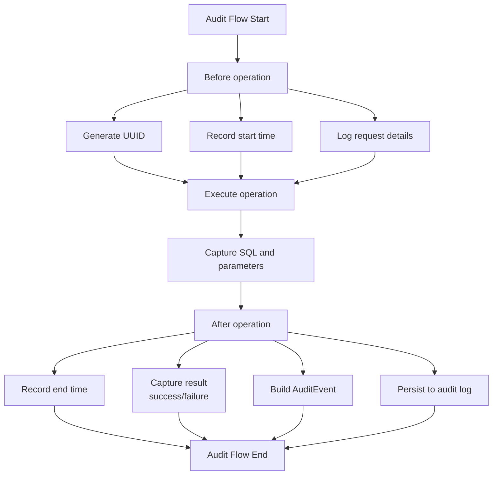
```mermaid
flowchart TD
    Start[Audit Flow Start] --> BeforeOp[Before operation]

    BeforeOp --> GenUUID[Generate UUID]
    BeforeOp --> RecordStart[Record start time]
    BeforeOp --> LogDetails[Log request details]

    GenUUID --> ExecuteOp[Execute operation]
    RecordStart --> ExecuteOp
    LogDetails --> ExecuteOp

    ExecuteOp --> CaptureSQL[Capture SQL and parameters]

    CaptureSQL --> AfterOp[After operation]
    AfterOp --> RecordEnd[Record end time]
    AfterOp --> CaptureResult[Capture result<br/>success/failure]
    AfterOp --> BuildEvent[Build AuditEvent]
    AfterOp --> Persist[Persist to audit log]

    RecordEnd --> End[Audit Flow End]
    CaptureResult --> End
    BuildEvent --> End
    Persist --> End
```

#### 6. Cache Module (`cache.rs`)

**Responsibility:** Entity data caching

**Cache Architecture:**

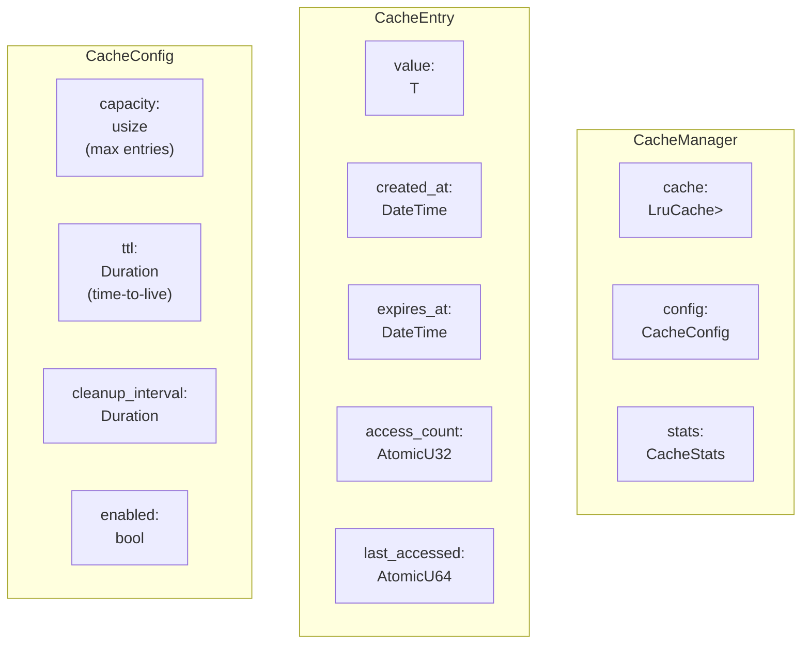
```mermaid
graph TD
    subgraph CacheManager["CacheManager<T>"]
        cache["cache:<br/>LruCache<CacheKey, CacheEntry<T>>"]
        config["config:<br/>CacheConfig"]
        stats["stats:<br/>CacheStats"]
    end

    subgraph CacheEntry["CacheEntry<T>"]
        value["value:<br/>T"]
        created_at["created_at:<br/>DateTime<Utc>"]
        expires_at["expires_at:<br/>DateTime<Utc>"]
        access_count["access_count:<br/>AtomicU32"]
        last_accessed["last_accessed:<br/>AtomicU64"]
    end

    subgraph CacheConfig["CacheConfig"]
        capacity["capacity:<br/>usize<br/>(max entries)"]
        ttl["ttl:<br/>Duration<br/>(time-to-live)"]
        cleanup_interval["cleanup_interval:<br/>Duration"]
        enabled["enabled:<br/>bool"]
    end
```

**Cache Strategy:**

- **LRU Eviction**: Least recently used entries are evicted first
- **TTL Expiration**: Entries expire after configured time
- **Write-Through**: Cache is updated on writes

#### 7. Sharding Module (`sharding.rs`)

**Responsibility:** Data distribution across shards

**Sharding Strategies:**

```rust
pub enum ShardingStrategy {
    Yearly,    // One shard per year
    Monthly,    // One shard per month
    Daily,      // One shard per day
    Hash,       // Consistent hash sharding
}

pub trait ShardingStrategy: Send + Sync {
    fn get_shard_name(&self, timestamp: DateTime<Utc>) -> String;
    fn calculate_shard(&self, key: &str, total_shards: usize) -> usize;
}
```

**Example: Monthly Sharding**

```rust
impl ShardingStrategy for MonthlyStrategy {
    fn get_shard_name(&self, timestamp: DateTime<Utc>) -> String {
        format!("{}_{}", timestamp.year(), timestamp.month())
    }
}
```

#### 8. Global Index Module (`global_index.rs`)

**Responsibility:** Cross-shard indexing

**Global Index Architecture:**

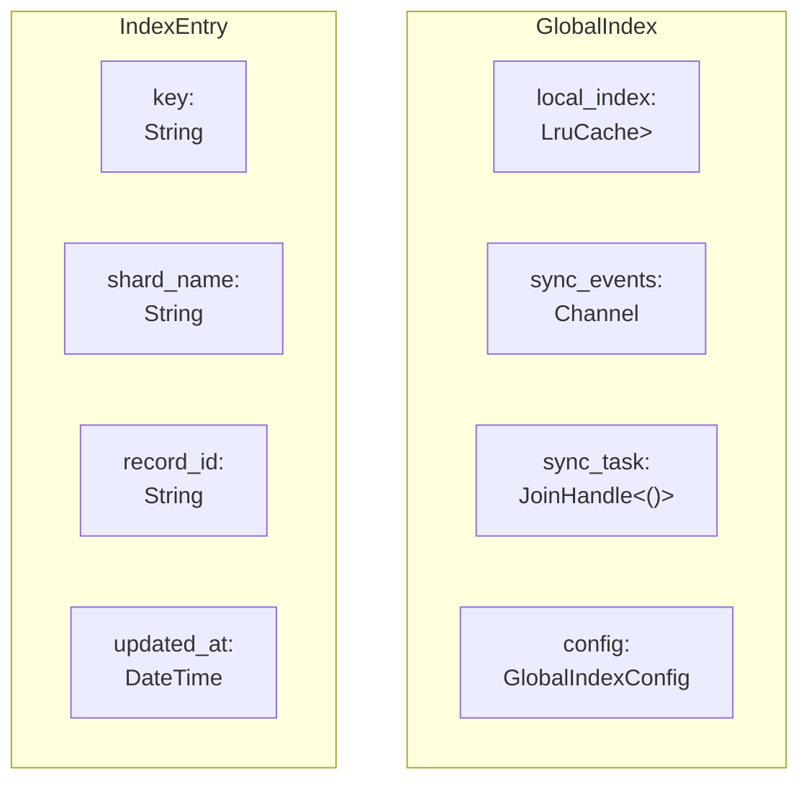
```mermaid
graph TD
    subgraph GlobalIndex["GlobalIndex"]
        local_index["local_index:<br/>LruCache<String, Vec<IndexEntry>>"]
        sync_events["sync_events:<br/>Channel<SyncEvent>"]
        sync_task["sync_task:<br/>JoinHandle<()>"]
        config["config:<br/>GlobalIndexConfig"]
    end

    subgraph IndexEntry["IndexEntry"]
        key["key:<br/>String"]
        shard_name["shard_name:<br/>String"]
        record_id["record_id:<br/>String"]
        updated_at["updated_at:<br/>DateTime<Utc>"]
    end
```

**Sync Flow:**

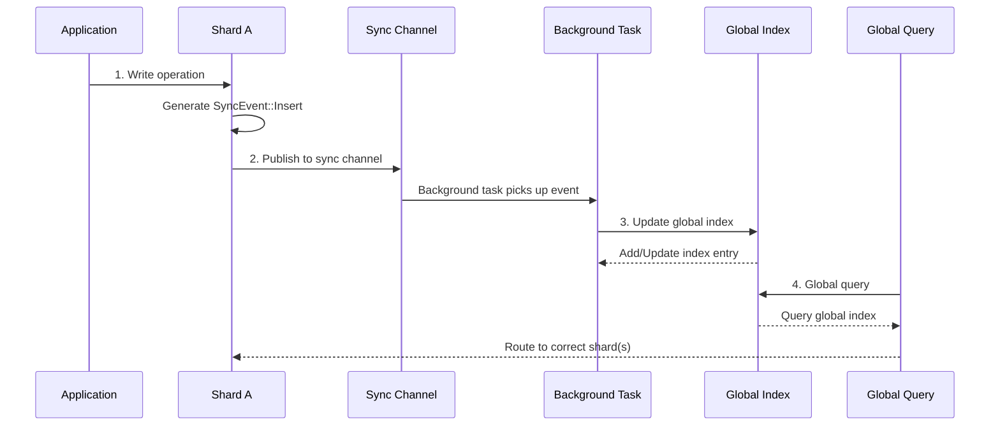
```mermaid
sequenceDiagram
    participant App as Application
    participant ShardA as Shard A
    participant Channel as Sync Channel
    participant Task as Background Task
    participant GlobalIdx as Global Index
    participant Query as Global Query

    App->>ShardA: 1. Write operation
    ShardA->>ShardA: Generate SyncEvent::Insert
    ShardA->>Channel: 2. Publish to sync channel

    Channel->>Task: Background task picks up event
    Task->>GlobalIdx: 3. Update global index
    GlobalIdx-->>Task: Add/Update index entry

    Query->>GlobalIdx: 4. Global query
    GlobalIdx-->>Query: Query global index
    Query-->>ShardA: Route to correct shard(s)
```

---

## Core Components

### 1. Procedural Macros System

**Purpose:** Compile-time code generation for boilerplate reduction

**Macros Provided:**

| Macro | Purpose |
|--------|---------|
| `#[derive(DbEntity)]` | Map struct to database table |
| `#[db_crud]` | Generate CRUD methods |
| `#[db_permission]` | Generate permission checks |
| `#[db_cache]` | Generate cache annotations |
| `#[db_audit]` | Generate audit annotations |

**Macro Expansion Example:**

**Input:**
```rust
#[derive(DbEntity)]
#[table_name = "users"]
#[db_crud]
#[db_permission(roles = ["admin", "manager"])]
struct User {
    #[primary_key]
    id: i64,
    name: String,
}
```

**Generated Code (simplified):**
```rust
impl User {
    // CRUD methods
    pub async fn insert(session: &Session, value: User) -> DbResult<User> { /* ... */ }
    pub async fn find_by_id(session: &Session, id: i64) -> DbResult<Option<User>> { /* ... */ }
    pub async fn update(session: &Session, value: User) -> DbResult<User> { /* ... */ }
    pub async fn delete(session: &Session, id: i64) -> DbResult<()> { /* ... */ }

    // Permission methods
    pub const ALLOWED_ROLES: &[&str] = &["admin", "manager"];
    pub fn check_permission(ctx: &PermissionContext) -> DbResult<()> {
        if !Self::ALLOWED_ROLES.contains(&ctx.role()) {
            return Err(DbError::Permission(...));
        }
        Ok(())
    }

    // Entity methods
    pub const TABLE_NAME: &str = "users";
    pub const PRIMARY_KEY: &str = "id";
}
```

### 2. SQL Parser

**Purpose:** Extract operation type and target table from SQL

**Supported Operations:**

```rust
pub enum SqlOperationType {
    Select,    // SELECT queries
    Insert,    // INSERT statements
    Update,    // UPDATE statements
    Delete,    // DELETE statements
    Ddl,       // CREATE/ALTER/DROP/TRUNCATE
    Dcl,       // GRANT/REVOKE
    Transaction, // BEGIN/COMMIT/ROLLBACK
    Other,      // Everything else
}
```

**Usage:**

```rust
let parser = SqlParser::new();
let (table_name, operation) = parser.parse_operation("SELECT * FROM users WHERE id = 1")?;

// Returns: ("users", SqlOperationType::Select)
```

### 3. Health Check System

**Purpose:** Maintain connection pool health

**Architecture:**

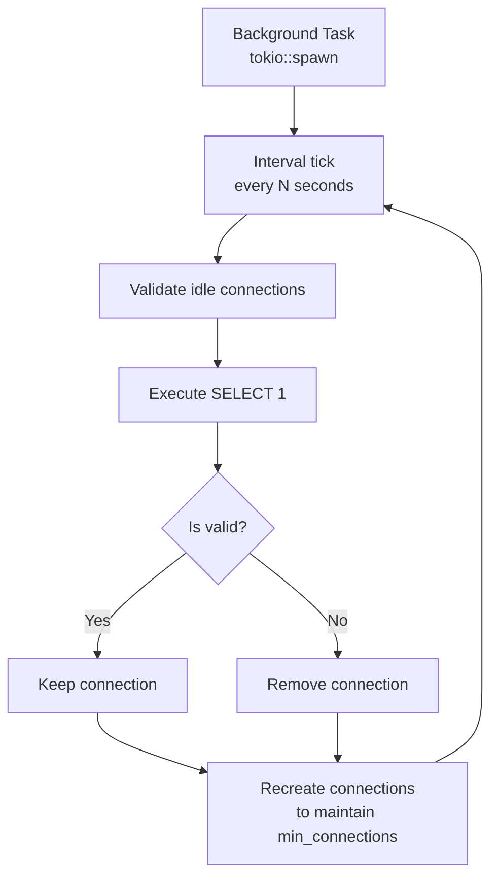
```mermaid
flowchart TD
    Start[Background Task<br/>tokio::spawn] --> Interval[Interval tick<br/>every N seconds]

    Interval --> Validate[Validate idle connections]
    Validate --> Execute[Execute SELECT 1]
    Execute --> CheckValid{Is valid?}

    CheckValid -->|Yes| Keep[Keep connection]
    CheckValid -->|No| Remove[Remove connection]

    Keep --> Recreate[Recreate connections<br/>to maintain min_connections]
    Remove --> Recreate

    Recreate --> Interval
```

**Health Check Implementation:**

```rust
pub async fn validate_and_recreate_connections(&self) -> Result<u32, sea_orm::DbErr> {
    let mut invalid_count = 0;

    for conn in idle_connections.drain(..) {
        let is_valid = timeout(Duration::from_secs(2), conn.execute_raw("SELECT 1"))
            .await
            .is_ok_and(|result| result.is_ok());

        if is_valid {
            valid_connections.push(conn);
        } else {
            invalid_count += 1;
        }
    }

    // Recreate to maintain minimum
    let needed = min_connections - valid_connections.len();
    for _ in 0..needed {
        let new_conn = create_connection().await?;
        valid_connections.push(new_conn);
    }

    Ok(invalid_count)
}
```

---

## Data Flow

### Query Flow

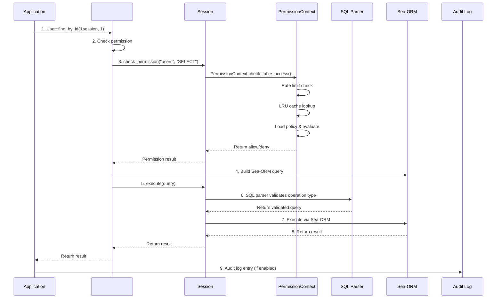
```mermaid
sequenceDiagram
    participant App as Application
    participant CRUD as #[db_crud]
    participant Session as Session
    participant PermCtx as PermissionContext
    participant Parser as SQL Parser
    participant SeaORM as Sea-ORM
    participant Audit as Audit Log

    App->>CRUD: 1. User::find_by_id(&session, 1)
    CRUD->>CRUD: 2. Check permission
    CRUD->>Session: 3. check_permission("users", "SELECT")

    Session->>PermCtx: PermissionContext.check_table_access()
    PermCtx->>PermCtx: Rate limit check
    PermCtx->>PermCtx: LRU cache lookup
    PermCtx->>PermCtx: Load policy & evaluate
    PermCtx-->>Session: Return allow/deny

    Session-->>CRUD: Permission result
    CRUD->>SeaORM: 4. Build Sea-ORM query
    CRUD->>Session: 5. execute(query)

    Session->>Parser: 6. SQL parser validates operation type
    Parser-->>Session: Return validated query

    Session->>SeaORM: 7. Execute via Sea-ORM
    SeaORM-->>Session: 8. Return result
    Session-->>CRUD: Return result
    CRUD-->>App: Return result

    App->>Audit: 9. Audit log entry (if enabled)
```

### Write Flow (with Transaction)

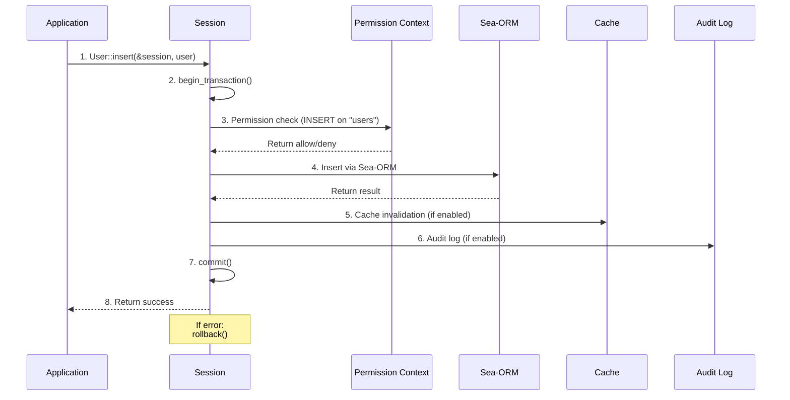
```mermaid
sequenceDiagram
    participant App as Application
    participant Session as Session
    participant PermCtx as Permission Context
    participant SeaORM as Sea-ORM
    participant Cache as Cache
    participant Audit as Audit Log

    App->>Session: 1. User::insert(&session, user)
    Session->>Session: 2. begin_transaction()

    Session->>PermCtx: 3. Permission check (INSERT on "users")
    PermCtx-->>Session: Return allow/deny

    Session->>SeaORM: 4. Insert via Sea-ORM
    SeaORM-->>Session: Return result

    Session->>Cache: 5. Cache invalidation (if enabled)
    Session->>Audit: 6. Audit log (if enabled)

    Session->>Session: 7. commit()
    Session-->>App: 8. Return success

    Note over Session: If error:<br/>rollback()
```

---

## Security Architecture

### Defense in Depth

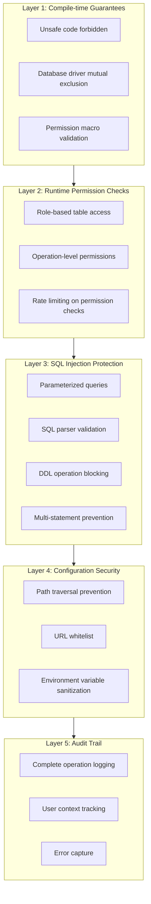
```mermaid
graph TD
    subgraph Layer1["Layer 1: Compile-time Guarantees"]
        Unsafe[Unsafe code forbidden]
        DriverMutual[Database driver mutual exclusion]
        PermMacro[Permission macro validation]
    end

    subgraph Layer2["Layer 2: Runtime Permission Checks"]
        RoleAccess[Role-based table access]
        OpPerm[Operation-level permissions]
        RateLimit[Rate limiting on permission checks]
    end

    subgraph Layer3["Layer 3: SQL Injection Protection"]
        ParamQueries[Parameterized queries]
        SQLParser[SQL parser validation]
        DDLBlock[DDL operation blocking]
        MultiStmt[Multi-statement prevention]
    end

    subgraph Layer4["Layer 4: Configuration Security"]
        PathPrev[Path traversal prevention]
        URLWhitelist[URL whitelist]
        EnvSanitize[Environment variable sanitization]
    end

    subgraph Layer5["Layer 5: Audit Trail"]
        OpLog[Complete operation logging]
        UserTrack[User context tracking]
        ErrorCapture[Error capture]
    end

    Layer1 --> Layer2
    Layer2 --> Layer3
    Layer3 --> Layer4
    Layer4 --> Layer5
```

### Permission Model

```mermaid
graph TD
    subgraph PermConfig["Permission Config (YAML)"]
        Roles[Roles]
    end

    subgraph Admin["admin"]
        AdminTables[tables: *<br/>all operations]
    end

    subgraph Manager["manager"]
        ManagerTables[tables: users, orders]
        ManagerOps[operations: SELECT, INSERT, UPDATE]
    end

    subgraph User["user"]
        UserTables[tables: users]
        UserOps[operations: SELECT]
    end

    Roles --> Admin
    Roles --> Manager
    Roles --> User

    Admin --> AdminTables
    Manager --> ManagerTables
    ManagerTables --> ManagerOps
    User --> UserTables
    UserTables --> UserOps

    subgraph Algorithm["Permission Check Algorithm"]
        Step1[1. Get role from session]
        Step2[2. Lookup role policy<br/>(or use cache)]
        Step3{3. Is "*"?}
        Step4[3a. Grant all access]
        Step5[3b. Check operation list]
        Step6[4. For specific table:<br/>check operation list]
        Step7[5. Return Allow/Deny]
    end

    Step1 --> Step2
    Step2 --> Step3
    Step3 -->|Yes| Step4
    Step3 -->|No| Step5
    Step5 --> Step6
    Step4 --> Step7
    Step6 --> Step7
```

---

## Performance Architecture

### Zero-Cost Abstractions

```rust
// Feature-gated compilation
#[cfg(feature = "metrics")]
pub fn track_metric(&self, name: &str, value: u64) {
    // Metrics code
}

#[cfg(not(feature = "metrics"))]
pub fn track_metric(&self, name: &str, value: u64) {
    // No-op - compiled away
}
```

### Lock-Free Counters

```rust
pub struct PoolStatus {
    pub total: AtomicU32,      // Lock-free
    pub active: AtomicU32,     // Lock-free
    pub wait_count: AtomicU32,  // Lock-free
}
```

### Asynchronous Operations

- All I/O uses `async/await`
- `AsyncMutex` for protecting shared state
- `Notify` instead of condition variables (avoids busy waiting)

### Connection Pooling

```
Strategy: Pool + LRU

Benefits:
├── Reuse connections (avoid TCP handshake)
├── Limit maximum connections (prevent exhaustion)
├── Maintain minimum (avoid cold starts)
└── Health checking (remove dead connections)
```

---

## Scalability Architecture

### Horizontal Scaling (Sharding)

```mermaid
flowchart TD
    App[Application] --> ShardRouter[ShardRouter]

    ShardRouter --> Yearly[YearlyStrategy]
    ShardRouter --> Monthly[MonthlyStrategy]
    ShardRouter --> Hash[HashStrategy]

    Yearly --> Shard2024[shard_2024]
    Monthly --> Shard2024_01[shard_2024_01]
    Hash --> ShardHash[shard_{hash key % N}]

    App --> QueryRouting[Query Routing]
    QueryRouting --> GlobalIndex[Global Index<br/>optional]
    GlobalIndex --> Route[Route to correct shard]
```

### Vertical Scaling (Caching)

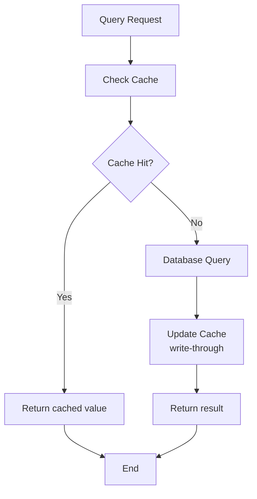
```mermaid
flowchart TD
    Start[Query Request] --> CheckCache[Check Cache]

    CheckCache --> Hit{Cache Hit?}
    Hit -->|Yes| ReturnCached[Return cached value]
    Hit -->|No| DBQuery[Database Query]

    DBQuery --> UpdateCache[Update Cache<br/>write-through]
    UpdateCache --> ReturnDB[Return result]

    ReturnCached --> End[End]
    ReturnDB --> End
```

### Feature-Based Scaling

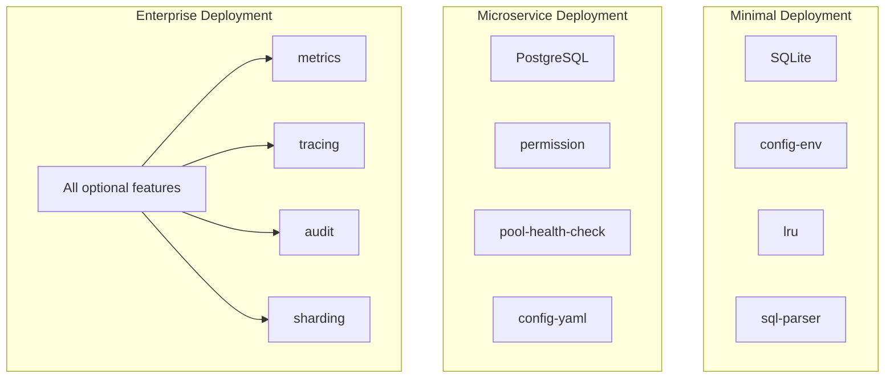
```mermaid
graph TD
    subgraph Minimal["Minimal Deployment"]
        SQLite[SQLite]
        config_env[config-env]
        lru[lru]
        sql_parser[sql-parser]
    end

    subgraph Microservice["Microservice Deployment"]
        PostgreSQL[PostgreSQL]
        permission[permission]
        pool_health_check[pool-health-check]
        config_yaml[config-yaml]
    end

    subgraph Enterprise["Enterprise Deployment"]
        AllFeatures[All optional features]
        metrics[metrics]
        tracing[tracing]
        audit[audit]
        sharding[sharding]
    end

    AllFeatures --> metrics
    AllFeatures --> tracing
    AllFeatures --> audit
    AllFeatures --> sharding
```

---

## Conclusion

DBNexus architecture is designed with:

1. **Modularity** - Clear separation of concerns, feature-gated
2. **Safety** - RAII, compile-time guarantees, no unsafe code
3. **Performance** - Async-first, lock-free where possible, efficient pooling
4. **Security** - Multi-layer defense, RBAC, audit trail
5. **Extensibility** - Pluggable components, trait-based design
6. **Observability** - Metrics, tracing, audit logging built-in

This architecture enables DBNexus to scale from embedded devices to enterprise deployments while maintaining simplicity and ergonomics.

For more details on specific components, see:
- [API Reference](API_REFERENCE.md)
- [User Guide](USER_GUIDE.md)
- [Rust Docs](https://docs.rs/dbnexus)
