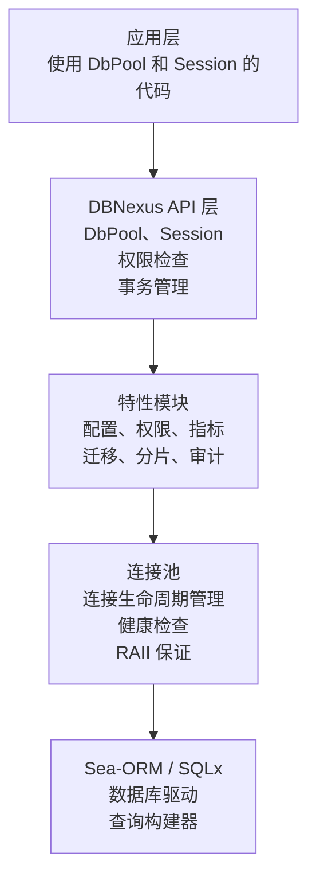
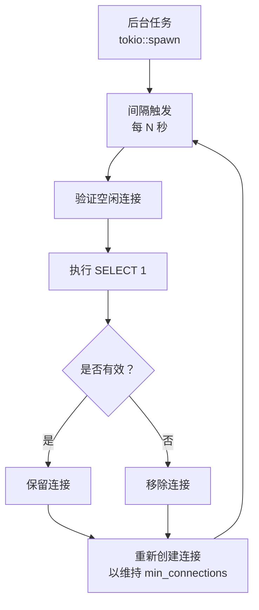
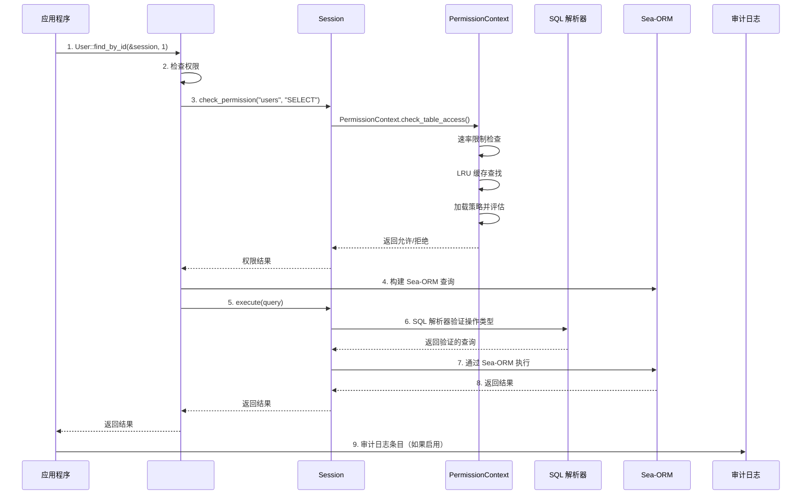
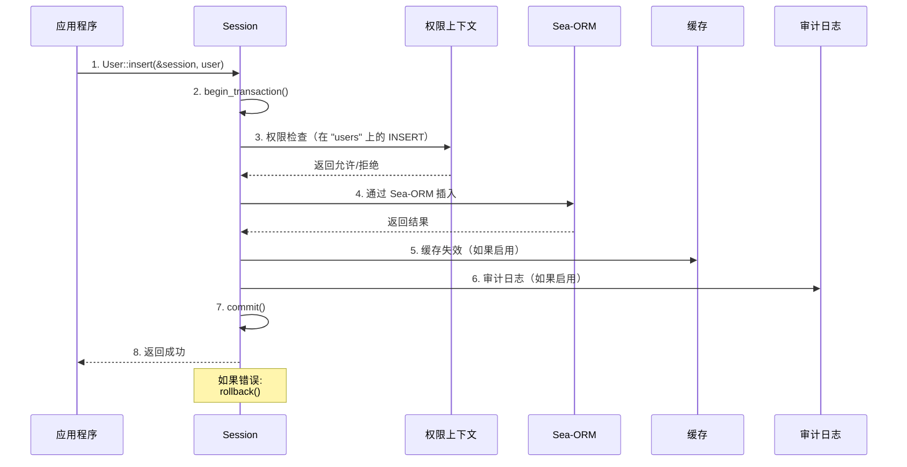
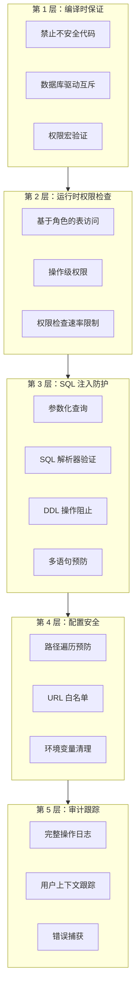
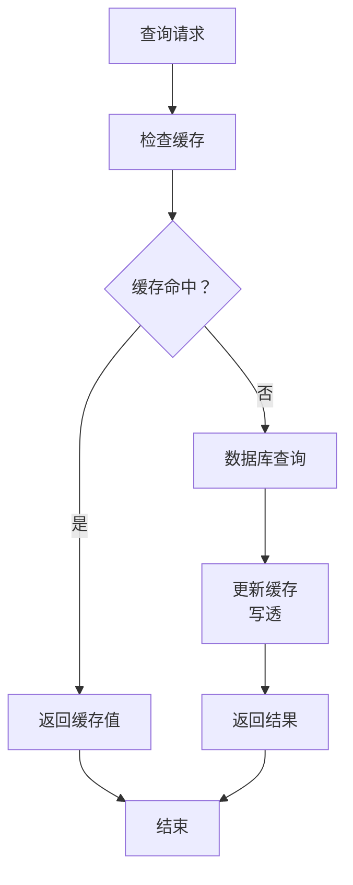
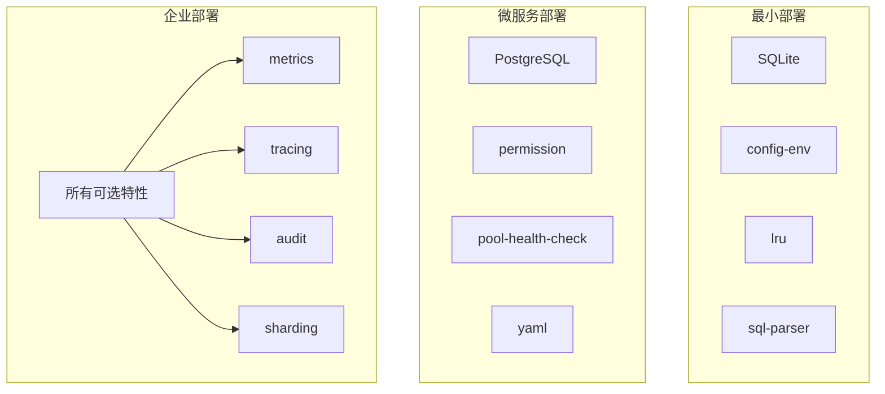

# DBNexus 架构

## 目录

- [概述](#概述)
- [设计原则](#设计原则)
- [系统架构](#系统架构)
- [模块架构](#模块架构)
- [核心组件](#核心组件)
- [数据流](#数据流)
- [安全架构](#安全架构)
- [性能架构](#性能架构)
- [可扩展性架构](#可扩展性架构)

---

## 概述

DBNexus 是一个基于 Sea-ORM 构建的企业级数据库抽象层。架构遵循**分层设计**，具有清晰的关注点分离，使开发者能够通过特性门控选择他们需要的确切功能。

### 关键架构目标

1. **模块化** - 特性门控编译以获得最小二进制文件
2. **安全性** - 基于 RAII 的资源管理和编译时保证
3. **性能** - 异步优先设计与高效连接池
4. **可扩展性** - 可插拔组件（权限引擎、缓存策略）
5. **可观测性** - 内置指标和审计日志（可选特性）

---

## 设计原则

### 1. RAII 资源管理

所有数据库连接都使用 Rust 的 RAII（资源获取即初始化）模式进行管理：

```rust
{
    let session = pool.get_session("admin").await?;
    // 使用会话...
    // 当会话被丢弃时连接自动释放
}
```

**优势：**
- 自动连接清理
- 无需手动资源管理
- 异常安全保证

### 2. 特性门控架构

特性被组织成逻辑组并在编译时启用：

**核心特性（始终可用）：**
- 带 RAII 管理的连接池
- 基本配置管理
- 数据库驱动选择（SQLite、PostgreSQL、MySQL、DuckDB）
- ICU4X 国际化格式化（locale 感知的数字/日期/复数/排序）

**可选核心特性：**
- `permission` - 基于角色的访问控制
- `sql-parser` - 用于权限检查的 SQL 解析（含 SQL 注入检测）
- `macros` - 用于代码生成的过程宏

**企业特性（可选）：**
- `metrics` - Prometheus 指标收集
- `tracing` - OpenTelemetry 集成（0.3.0 增强：OTLP 导出）
- `audit` - 全面审计日志
- `migration` - 数据库迁移管理
- `sharding` - 数据分片支持（0.3.0 增强：会话级分片路由）
- `cache` - oxcache 缓存（内部 moka L1 后端）
- `authentication` - JWT 认证 + 密码强度验证（0.3.0 新增）
- `health-check` - 健康检查 + 熔断器（0.3.0 新增）
- `permission-engine` - 高级权限引擎（RBAC + ABAC）
- `global-index` - 跨分片全局索引
- `ladybug` - 嵌入式图数据库（0.4.0 新增）
- `neo4j` - Neo4j 图数据库服务器（0.4.0 新增）
- `kit` - trait-kit 能力管理集成（0.4.0 新增）

**特性依赖关系（编译时强制）：**

| 特性 | 依赖 | 原因 |
|------|------|------|
| `permission` | → `sql-parser`（强制） | 防止 SQL 注入绕过权限检查；同时传递依赖 `dashmap`、`futures`、`yaml` |
| `sql-parser` | → `cache`（自动启用） | 缓存解析结果以提升性能；同时依赖 `sqlparser`、`once_cell`、`regex`、`unicode-normalization` |
| `permission-engine` | → `cache`、`dashmap`、`futures`、`once_cell`、`regex` | 高级权限引擎需要缓存策略决策、并发 map、异步和正则支持 |

> 这些依赖关系在 `src/lib.rs` 中通过 `compile_error!` 宏强制检查，缺失依赖将导致编译失败。

### 3. 异步优先设计

所有 I/O 操作都使用带有 Tokio 的 `async/await`：

- `AsyncMutex` 用于线程安全状态
- `Notify` 用于高效条件等待
- `tokio::spawn` 用于后台任务

### 4. 类型安全抽象

编译时保证防止常见错误：

- **数据库驱动互斥**：只能启用一个数据库驱动
- **权限验证**：编译时角色验证
- **类型安全**：所有数据库操作都是类型安全的

---

## 系统架构

### 高层级分层图


```mermaid
graph TD
    A[应用层<br/>使用 DbPool 和 Session 的代码] --> B[DBNexus API 层<br/>DbPool、Session<br/>权限检查<br/>事务管理]
    B --> C[特性模块<br/>配置、权限、指标<br/>迁移、分片、审计]
    C --> D[连接池<br/>连接生命周期管理<br/>健康检查<br/>RAII 保证]
    D --> E[Sea-ORM / SQLx<br/>数据库驱动<br/>查询构建器]
```

### 组件交互流程

1. **应用程序**从 `DbPool` 请求具有特定角色的会话
2. **DbPool** 验证角色并创建带有数据库连接的 `Session`
3. **Session** 处理所有数据库操作并进行自动权限检查
4. **权限系统**基于角色策略验证表访问
5. **连接**在会话被丢弃时自动返回到池中

### 关键实现细节

- **连接池**：使用 `AsyncMutex<Vec<DatabaseConnection>>` 配合原子计数器
- **权限缓存**：角色策略的 oxcache 缓存（内部 moka L1 后端）以提高性能
- **健康检查**：后台任务定期验证空闲连接
- **RAII 管理**：会话丢弃时连接自动释放

---

## 模块架构

DBNexus 采用清晰的分层架构，每层有明确职责。各层通过 `src/lib.rs` 统一声明和导出。

### 0. 顶层模块

统一错误类型和模块声明。

- `lib.rs` — 模块声明、编译期特性互斥检查、公共 API 导出
- `error.rs` — `DbNexusError`、`DbNexusResult`、`ErrorCategory`、`QueryErrorReport`（顶层统一错误类型）

### 1. 公共类型层 (`common/`)

零依赖的基础类型，被所有层共用。

- `common/mod.rs` — 模块入口
- `common/error.rs` — `DbNexusError`、`DbNexusResult`、`ErrorCategory`、`QueryErrorReport`（顶层统一错误类型）

### 2. 基础层 (`foundation/`)

配置和错误处理的基础设施，无业务逻辑。

- `foundation/mod.rs` — 模块入口，re-export config/error 及 Sea-ORM trait（`ActiveModelTrait`、`EntityTrait`、`Condition`、`Set`）
- `foundation/config/` — 配置系统（纯数据结构，通过 serde 反序列化）
  - `mod.rs` — 模块入口
  - `types.rs` — `DbConfig`、`CacheConfig`、`PoolConfig`、`DatabaseType`、`ConfigError`
- `foundation/error/` — 子错误类型
  - `mod.rs` — `DbError`、`DbResult`、`AuditError`、`MigrationError`、`MigrationResult`、`ConfigResult`、`PermissionResult`、`PoolResult`

> **注意**：顶层统一错误类型 `DbNexusError` 定义在 `common/error.rs`，本层定义各模块的子错误类型。

### 3. 领域层 (`domain/`)

业务领域接口和数据模型，可依赖 foundation 层和第三方库。

- `domain/mod.rs` — 模块入口
- `domain/audit/` — 审计领域（cfg = "audit"）
  - `mod.rs` — `AuditLogger`、`AuditEvent`、`AuditEventBuilder`、`AuditOperation`、`AuditSeverity`、`AuditStatus`、`AuditStorage`、`MemoryAuditStorage`、`AuditContext`、`AuditQueryFilters`、`AuditConfig`
- `domain/migration/` — 迁移领域
  - `mod.rs` — 模块入口
  - `schema.rs`、`types.rs`、`converter.rs`、`metadata.rs`、`column_changes.rs` — 基础模块（始终可用，供 `#[db_entity]` 宏生成的 `schema()` 方法使用）
  - `executor.rs`、`differ.rs`、`sql_reverser.rs` — 执行模块（cfg = "migration"，依赖 `sqlparser` 和 `regex`）
- `domain/permission/` — 权限领域接口（cfg = "permission"）
  - `mod.rs` — `PermissionProvider`、`PermissionChecker`、`PolicyManager`、`PermissionLifecycle` trait，工厂函数 `new`/`with_cache`/`new_in_memory`
  - `interface.rs` — trait 定义
  - `config.rs` — `PermissionConfig`、`DefaultPolicy`
  - `types.rs` — `PermissionAction`、`RolePolicy`、`TablePermission`、`PolicySet`
  - `error.rs` — `PermissionError`、`PermissionConfigError`
  - `impl_/` — 实现（`default.rs` = `YamlPermissionProvider`，`memory.rs` = `MemoryPermissionProvider`）

### 4. 数据库层 (`database/`)

数据库连接、会话和分片管理。

- `database/mod.rs` — 模块入口
- `database/pool/` — 连接池
  - `mod.rs` — `ConnectionPool` trait、`DatabaseSession` trait、`DbPoolBuilder`、`DbConnection` 枚举、`PoolStatus`
  - `db_pool.rs` — `DbPool`、`DatabaseConnection` 类型别名
  - `session.rs` — `Session`（RAII 会话，drop 时自动归还连接）
  - `duckdb_conn.rs` — `DuckDbConnection`、`DuckDbRow`、`DuckDbExecResult`（cfg = "duckdb"，0.3.0 新增）
  - `pool_impl.rs` — 连接池内部实现
  - `audit.rs` — 安全审计日志（admin 旁路操作审计）
- `database/graph/` — 图数据库（0.4.0 新增）
  - `mod.rs` — `GraphConnection` trait、`GraphTransaction` trait、`GraphNode`、`GraphRel`、`GraphRow`、`GraphValue`、`GraphExecResult`、`GraphQueryResult`
  - `ladybug_conn.rs` — `LadybugConnection`（cfg = "ladybug"，嵌入式图数据库）
  - `neo4j_conn.rs` — `Neo4jConnection`（cfg = "neo4j"，Neo4j 服务器）
- `database/sharding.rs` — `ShardRouter`、`ShardConfig`、`ShardingStrategy` trait、`create_strategy`（cfg = "sharding"）
- `database/migration/` — 运行时迁移执行器（cfg = "migration"，重导出 `domain::migration`）

### 5. 访问层 (`access/`)

权限控制、安全检查、认证。

- `access/mod.rs` — 模块入口
- `access/permission/` — 运行时 RBAC 权限（cfg = "permission"）
  - `mod.rs` — 模块入口，re-export 各子模块
  - `types.rs` — `PermissionAction`、`PermissionConfig`、`RolePolicy`、`TablePermission`、`PermissionError`
  - `context.rs` — `PermissionContext`（缓存 + 速率限制 + 缓存击穿防护，cfg = "cache"）
  - `cache.rs` — `PermissionCache`、`PermissionCacheConfig`（TTL + SWR 缓存，0.3.0 新增）
  - `provider.rs` — `PermissionProvider` trait、`MemoryPermissionProvider`、`YamlPermissionProvider`、`RefreshablePermissionProvider`
  - `rate_limiter.rs` — `RateLimiter`（速率限制）
  - `stats.rs` — `PermissionCheckStats`、`CacheStats`（权限统计）
  - `rbac.rs` — `RbacProvider`（RBAC 实现）
  - `advanced.rs` — `AdvancedRbacProvider`（高级权限功能）
- `access/security/` — 安全模块
  - `mod.rs` — 模块入口
  - `ddl_guard.rs` — `DdlGuard`、`DdlValidationResult`（cfg = "sql-parser"，AST-based DDL 验证）
  - `sensitive.rs` — `SensitiveMasker`、`MaskType`、`SensitiveError`、`SensitiveResult`（数据脱敏）
- `access/authentication/` — JWT 认证（cfg = "authentication"，0.3.0 新增）
  - `mod.rs` — `AuthenticationManager`、`AuthCredentials`、`AuthResult`、`AuthError`
  - `jwt.rs` — `JwtManager`、`JwtClaims`、`TokenType`
  - `password.rs` — `PasswordHasher`（bcrypt 哈希 + 密码强度验证）
  - `models.rs` — `User`、`AuthCredentials` 数据模型
- `access/permission_engine.rs` — `PolicyDecisionPoint`、`RbacPermissionProvider`、`PermissionRule`、`PermissionDecision`、`PermissionSubject`、`PermissionResource`、`Role`（cfg = "permission-engine"，RBAC + ABAC 高级权限引擎）
- `access/sql_parser.rs` — `SqlParser`、`SqlParseError`、`is_ddl_operation`、`contains_sql_injection`（cfg = "sql-parser"）

#### 双 Permission 实现说明

项目中存在两套 permission 实现，分工明确：

- **`domain/permission/`** — 权限**领域接口层**，提供 trait 定义（`PermissionProvider`、`PermissionChecker`、`PolicyManager`、`PermissionLifecycle`）和配置类型。适用于仅需接口或配置类型的场景。
- **`access/permission/`** — 权限**运行时实现层**，提供 `PermissionContext`（缓存 + 速率限制 + 缓存击穿防护）、`RateLimiter`、`RbacProvider`/`AdvancedRbacProvider`、统计等运行时能力。适用于需要运行时上下文/缓存/速率限制的场景。

两层互补共存，非"已弃用"关系。新代码如需运行时上下文/缓存/速率限制，使用 `access/permission`；如仅需接口或配置类型，使用 `domain/permission`。

### 6. 观测层 (`observability/`)

可观测性基础设施。

- `observability/mod.rs` — 模块入口
- `observability/metrics.rs` — `MetricsCollector`、`MetricsCollectorTrait`、`QueryStats`、`LatencyPercentiles`、`LatencyHistogram`、`PoolMetrics`、`SlowQueryRecord`、`ThroughputStats`、`ConnectionAcquireStats`、`TransactionStats`（cfg = "metrics"，Prometheus 指标导出）
- `observability/health.rs` — `HealthChecker`、`HealthStatus`、`HealthCheckResult`、`CircuitBreaker`、`CircuitBreakerConfig`、`CircuitBreakerState`、`PoolHealthMetrics`（cfg = "health-check"，健康检查 + 熔断器）
- `observability/tracing.rs` — `TracingGuard`、`TracingError`（cfg = "tracing"，OpenTelemetry 集成）

### 7. 可靠性层 (`reliability/`)

运行时容错能力（重试、故障转移等）。

- `reliability/mod.rs` — 模块入口
- `reliability/retry.rs` — `RetryPolicy`、`RetryExecutor`、`RetryError`、`is_idempotent_operation`（cfg = "retry"，运行时重试 + 指数退避，仅幂等查询自动重试）

### 8. 存储层 (`storage/`)

- `storage/mod.rs` — 模块入口
- `storage/global_index.rs` — `GlobalIndex`、`IndexEntry`、`SyncEvent`、`SyncResult`、`SYNC_STATUS_PENDING`、`SYNC_STATUS_SYNCED`、`SYNC_STATUS_FAILED` 常量（cfg = "global-index"，跨分片全局索引）

### 9. 工具包层 (`kit/`)

基于 `trait-kit` 的统一能力管理。

- `integrations/kit/mod.rs` — `DbNexusModule`（cfg = "kit"，trait-kit 0.4 异步集成）
- `integrations/kit/module.rs` — `DbNexusModule` 实现
- `integrations/oxcache_adapter.rs` — `OxcacheDbCacheAdapter`（cfg = "oxcache-integration"）
- `integrations/mod.rs` — 模块入口

### 10. 国际化模块 (`i18n/`)

基于 ICU4X 的 locale 感知格式化（核心特性，始终可用）。

- `i18n/mod.rs` — 模块入口
- `i18n/i18n_impl.rs` — `DbI18nFormatter`、`I18nError`

### 自动生成模块

- `generated_roles.rs` — 编译时生成的角色常量（由 `#[db_entity]` 宏生成，`mod generated_roles;` 声明）

---

## 核心组件

### 1. 过程宏系统

**目的：**编译时代码生成以减少样板代码

**提供的宏：**

| 宏 | 目的 |
|--------|---------|
| `#[db_entity(...)]` | 统一的属性宏，将结构体映射到数据库表并生成 CRUD 方法、缓存、审计等功能 |

**宏扩展示例：**

**输入：**
```rust
#[db_entity(table_name = "users", primary_key = "id")]
#[derive(Clone, Debug, PartialEq, DeriveEntityModel)]
#[sea_orm(table_name = "users")]
struct User {
    #[sea_orm(primary_key)]
    id: i64,
    name: String,
}
```

**生成的代码（简化）：**
```rust
impl User {
    // CRUD 方法（0.4.2：find_by_id/find_by_ids/delete 主键泛型化，支持 i64/Uuid/String 等任意主键类型）
    pub async fn insert(session: &Session, value: User) -> DbResult<User> { /* ... */ }
    pub async fn find_by_id<PK>(session: &Session, pk: PK) -> DbResult<Option<User>>
    where PK: Into<<<Entity as sea_orm::EntityTrait>::PrimaryKey as sea_orm::entity::prelude::PrimaryKeyTrait>::ValueType>
    { /* ... */ }
    pub async fn find_by_ids<PK>(session: &Session, pks: Vec<PK>) -> DbResult<Vec<User>>
    where PK: Into<sea_orm::Value>
    { /* ... */ }
    pub async fn update(session: &Session, value: User) -> DbResult<User> { /* ... */ }
    // delete 约束随 soft_delete 宏参数变化：
    // - soft_delete=false（默认）：Into<PrimaryKey::ValueType>（对接 Entity::find_by_id）
    // - soft_delete=true：         Into<sea_orm::Value>（对接 Column::eq）
    // soft_delete=true 实体还会额外生成 force_delete 方法（约束同 Into<sea_orm::Value>）。
    pub async fn delete<PK>(session: &Session, pk: PK) -> DbResult<()>
    where PK: Into<<<Entity as sea_orm::EntityTrait>::PrimaryKey as sea_orm::entity::prelude::PrimaryKeyTrait>::ValueType>
    { /* ... */ }

    // 实体方法
    pub const TABLE_NAME: &str = "users";
    pub const PRIMARY_KEY: &str = "id";
}
```

### 2. SQL 解析器

**目的：**从 SQL 中提取操作类型和目标表

**支持的操作：**

```rust
pub enum SqlOperationType {
    Select,    // SELECT 查询
    Insert,    // INSERT 语句
    Update,    // UPDATE 语句
    Delete,    // DELETE 语句
    Ddl,       // CREATE/ALTER/DROP/TRUNCATE
    Dcl,       // GRANT/REVOKE
    Transaction, // BEGIN/COMMIT/ROLLBACK
    Other,      // 其他所有
}
```

**使用：**

```rust
let parser = SqlParser::new();
let (table_name, operation) = parser.parse_operation("SELECT * FROM users WHERE id = 1")?;

// 返回: ("users", SqlOperationType::Select)
```

### 3. 健康检查系统

**目的：**维护连接池健康

**架构：**


```mermaid
flowchart TD
    Start[后台任务<br/>tokio::spawn] --> Interval[间隔触发<br/>每 N 秒]

    Interval --> Validate[验证空闲连接]
    Validate --> Execute[执行 SELECT 1]
    Execute --> CheckValid{是否有效？}

    CheckValid -->|是| Keep[保留连接]
    CheckValid -->|否| Remove[移除连接]

    Keep --> Recreate[重新创建连接<br/>以维持 min_connections]
    Remove --> Recreate

    Recreate --> Interval
```

**健康检查实现：**

```rust
pub async fn validate_and_recreate_connections(&self) -> Result<u32, sea_orm::DbErr> {
    let mut invalid_count = 0;

    for conn in idle_connections.drain(..) {
        let is_valid = timeout(Duration::from_secs(2), conn.execute_raw("SELECT 1"))
            .await
            .is_ok_and(|result| result.is_ok());

        if is_valid {
            valid_connections.push(conn);
        } else {
            invalid_count += 1;
        }
    }

    // 重新创建以维持最小值
    let needed = min_connections - valid_connections.len();
    for _ in 0..needed {
        let new_conn = create_connection().await?;
        valid_connections.push(new_conn);
    }

    Ok(invalid_count)
}
```

---

## 数据流

### 查询流


```mermaid
sequenceDiagram
    participant App as 应用程序
    participant CRUD as #[db_entity]
    participant Session as Session
    participant PermCtx as PermissionContext
    participant Parser as SQL 解析器
    participant SeaORM as Sea-ORM
    participant Audit as 审计日志

    App->>CRUD: 1. User::find_by_id(&session, 1)
    CRUD->>CRUD: 2. 检查权限
    CRUD->>Session: 3. check_permission("users", "SELECT")

    Session->>PermCtx: PermissionContext.check_table_access()
    PermCtx->>PermCtx: 速率限制检查
    PermCtx->>PermCtx: LRU 缓存查找
    PermCtx->>PermCtx: 加载策略并评估
    PermCtx-->>Session: 返回允许/拒绝

    Session-->>CRUD: 权限结果
    CRUD->>SeaORM: 4. 构建 Sea-ORM 查询
    CRUD->>Session: 5. execute(query)

    Session->>Parser: 6. SQL 解析器验证操作类型
    Parser-->>Session: 返回验证的查询

    Session->>SeaORM: 7. 通过 Sea-ORM 执行
    SeaORM-->>Session: 8. 返回结果
    Session-->>CRUD: 返回结果
    CRUD-->>App: 返回结果

    App->>Audit: 9. 审计日志条目（如果启用）
```

### 写流（带事务）


```mermaid
sequenceDiagram
    participant App as 应用程序
    participant Session as Session
    participant PermCtx as 权限上下文
    participant SeaORM as Sea-ORM
    participant Cache as 缓存
    participant Audit as 审计日志

    App->>Session: 1. User::insert(&session, user)
    Session->>Session: 2. begin_transaction()

    Session->>PermCtx: 3. 权限检查（在 "users" 上的 INSERT）
    PermCtx-->>Session: 返回允许/拒绝

    Session->>SeaORM: 4. 通过 Sea-ORM 插入
    SeaORM-->>Session: 返回结果

    Session->>Cache: 5. 缓存失效（如果启用）
    Session->>Audit: 6. 审计日志（如果启用）

    Session->>Session: 7. commit()
    Session-->>App: 8. 返回成功

    Note over Session: 如果错误:<br/>rollback()
```

---

## 安全架构

### 纵深防御


```mermaid
graph TD
    subgraph Layer1["第 1 层：编译时保证"]
        Unsafe[禁止不安全代码]
        DriverMutual[数据库驱动互斥]
        PermMacro[权限宏验证]
    end

    subgraph Layer2["第 2 层：运行时权限检查"]
        RoleAccess[基于角色的表访问]
        OpPerm[操作级权限]
        RateLimit[权限检查速率限制]
    end

    subgraph Layer3["第 3 层：SQL 注入防护"]
        ParamQueries[参数化查询]
        SQLParser[SQL 解析器验证]
        DDLBlock[DDL 操作阻止]
        MultiStmt[多语句预防]
    end

    subgraph Layer4["第 4 层：配置安全"]
        PathPrev[路径遍历预防]
        URLWhitelist[URL 白名单]
        EnvSanitize[环境变量清理]
    end

    subgraph Layer5["第 5 层：审计跟踪"]
        OpLog[完整操作日志]
        UserTrack[用户上下文跟踪]
        ErrorCapture[错误捕获]
    end

    Layer1 --> Layer2
    Layer2 --> Layer3
    Layer3 --> Layer4
    Layer4 --> Layer5
```

### 权限模型

```mermaid
graph TD
    subgraph PermConfig["权限配置 (YAML)"]
        Roles[角色]
    end

    subgraph Admin["admin"]
        AdminTables[表: *<br/>所有操作]
    end

    subgraph Manager["manager"]
        ManagerTables[表: users, orders]
        ManagerOps[操作: SELECT, INSERT, UPDATE]
    end

    subgraph User["user"]
        UserTables[表: users]
        UserOps[操作: SELECT]
    end

    Roles --> Admin
    Roles --> Manager
    Roles --> User

    Admin --> AdminTables
    Manager --> ManagerTables
    ManagerTables --> ManagerOps
    User --> UserTables
    UserTables --> UserOps

    subgraph Algorithm["权限检查算法"]
        Step1[1. 从会话获取角色]
        Step2[2. 查找角色策略<br/>（或使用缓存）]
        Step3{3. 是 "*"？}
        Step4[3a. 授予所有访问]
        Step5[3b. 检查操作列表]
        Step6[4. 对于特定表：<br/>检查操作列表]
        Step7[5. 返回允许/拒绝]
    end

    Step1 --> Step2
    Step2 --> Step3
    Step3 -->|是| Step4
    Step3 -->|否| Step5
    Step5 --> Step6
    Step4 --> Step7
    Step6 --> Step7
```

---

## 性能架构

### 零成本抽象

```rust
// 特性门控编译
#[cfg(feature = "metrics")]
pub fn track_metric(&self, name: &str, value: u64) {
    // 指标代码
}

#[cfg(not(feature = "metrics"))]
pub fn track_metric(&self, name: &str, value: u64) {
    // 无操作 - 编译时移除
}
```

### 无锁计数器

```rust
pub struct PoolStatus {
    pub total: AtomicU32,      // 无锁
    pub active: AtomicU32,     // 无锁
    pub wait_count: AtomicU32,  // 无锁
}
```

### 异步操作

- 所有 I/O 使用 `async/await`
- `RwLock` 用于读多写少的共享状态（Session 内部状态），允许并发读
- `Mutex` 仅用于写密集路径（图操作互斥）
- `Notify` 而不是条件变量（避免忙等待）
- `AcqRel` 内存序替代 `SeqCst`，减少不必要的全局同步开销

### 连接池

```
策略: 池 + LRU

优势:
├── 重用连接（避免 TCP 握手）
├── 限制最大连接（防止耗尽）
├── 维持最小值（避免冷启动）
└── 健康检查（移除死连接）
```

---

## 可扩展性架构

### 水平扩展（分片）

```mermaid
flowchart TD
    App[应用程序] --> ShardRouter[分片路由器]

    ShardRouter --> Yearly[年度策略]
    ShardRouter --> Monthly[月度策略]
    ShardRouter --> Hash[哈希策略]

    Yearly --> Shard2024[shard_2024]
    Monthly --> Shard2024_01[shard_2024_01]
    Hash --> ShardHash[shard_{hash key % N}]

    App --> QueryRouting[查询路由]
    QueryRouting --> GlobalIndex[全局索引<br/>可选]
    GlobalIndex --> Route[路由到正确分片]
```

### 垂直扩展（缓存）


```mermaid
flowchart TD
    Start[查询请求] --> CheckCache[检查缓存]

    CheckCache --> Hit{缓存命中？}
    Hit -->|是| ReturnCached[返回缓存值]
    Hit -->|否| DBQuery[数据库查询]

    DBQuery --> UpdateCache[更新缓存<br/>写透]
    UpdateCache --> ReturnDB[返回结果]

    ReturnCached --> End[结束]
    ReturnDB --> End
```

### 基于特性的扩展


```mermaid
graph TD
    subgraph Minimal["最小部署"]
        SQLite[SQLite]
        config_env[config-env]
        lru[lru]
        sql_parser[sql-parser]
    end

    subgraph Microservice["微服务部署"]
        PostgreSQL[PostgreSQL]
        permission[permission]
        pool_health_check[pool-health-check]
        config_yaml[yaml]
    end

    subgraph Enterprise["企业部署"]
        AllFeatures[所有可选特性]
        metrics[metrics]
        tracing[tracing]
        audit[audit]
        sharding[sharding]
    end

    AllFeatures --> metrics
    AllFeatures --> tracing
    AllFeatures --> audit
    AllFeatures --> sharding
```

---

## 结论

DBNexus 架构设计具有：

1. **模块化** - 清晰的关注点分离，特性门控
2. **安全性** - RAII、编译时保证、无不安全代码
3. **性能** - 异步优先、尽可能无锁、高效池化
4. **安全性** - 多层防御、RBAC、审计跟踪
5. **可扩展性** - 可插拔组件、基于 trait 的设计
6. **可观测性** - 指标、跟踪、内置审计日志

这种架构使 DBNexus 能够从嵌入式设备扩展到企业部署，同时保持简单性和人体工程学。

更多组件细节，请参见：
- [API 参考](API_REFERENCE.md)
- [用户指南](USER_GUIDE.md)
- [Rust 文档](https://docs.rs/dbnexus)
