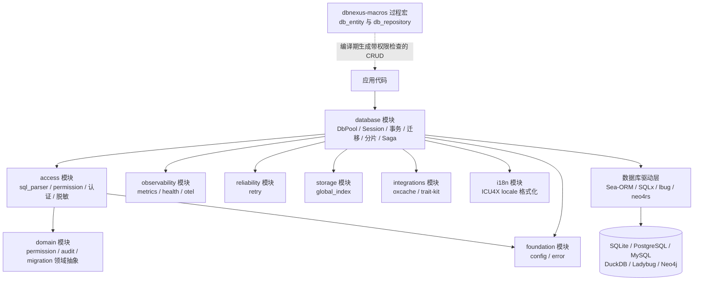
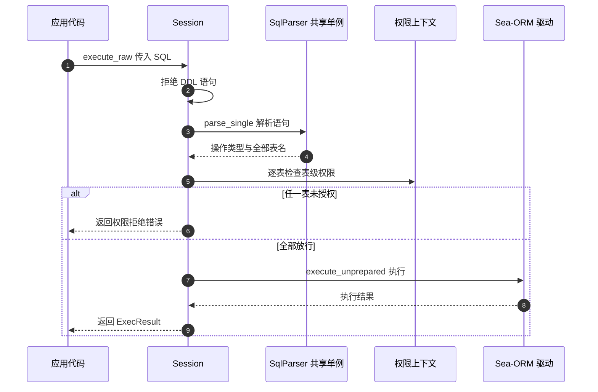
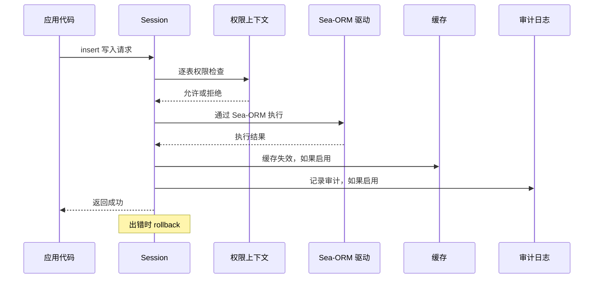
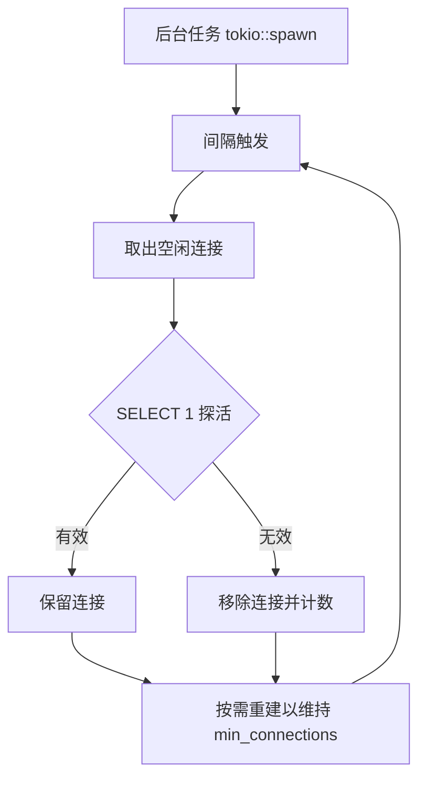
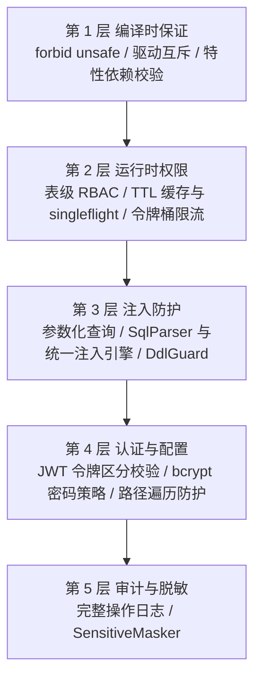
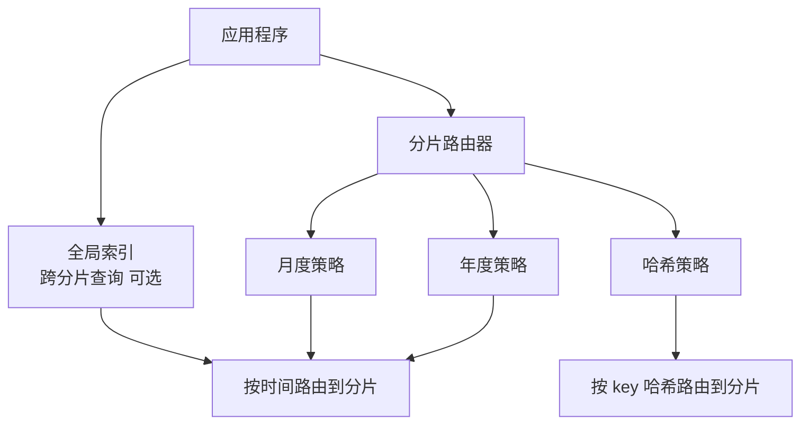
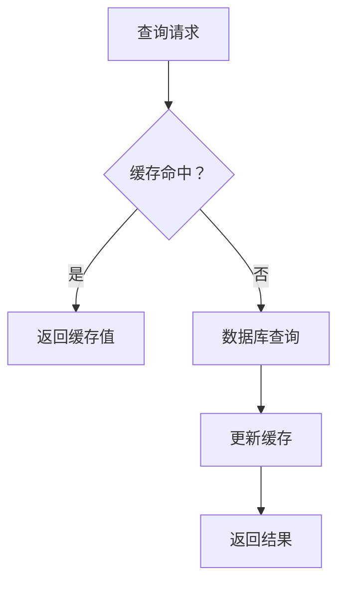

# 🏗️ Dbnexus 架构文档

DBNexus 是一个基于 Sea-ORM 构建的企业级 Rust 数据库抽象层。本文档描述其设计理念、系统架构、模块划分、数据流以及安全与性能设计。

> 周边文档：[📖 用户指南](USER_GUIDE.md) ｜ [📘 API 参考](API_REFERENCE.md) ｜ [🔒 安全文档](SECURITY.md) ｜ [📊 性能基线](PERFORMANCE.md)

## 📋 目录

<details open>
<summary>📑 目录</summary>

- [概述](#概述)
- [设计原则](#设计原则)
- [系统架构](#系统架构)
- [模块划分](#模块划分)
- [核心执行管道](#核心执行管道)
- [安全架构](#安全架构)
- [性能架构](#性能架构)
- [可扩展性架构](#可扩展性架构)
- [小结](#小结)

</details>

---

## 概述

DBNexus 的架构遵循**分层设计**，具有清晰的关注点分离，使开发者能够通过特性门控选择他们需要的确切功能。

**关键架构目标**：

1. **模块化** — 特性门控编译以获得最小二进制文件
2. **安全性** — 基于 RAII 的资源管理和编译时保证
3. **性能** — 异步优先设计与高效连接池
4. **可扩展性** — 可插拔组件（权限引擎、缓存策略、DDL 守卫）
5. **可观测性** — 内置指标和审计日志（可选特性）

---

## 设计原则

### 1. RAII 资源管理

所有数据库连接都使用 Rust 的 RAII（资源获取即初始化）模式进行管理：

```rust
{
    let session = pool.get_session("admin").await?;
    // 使用会话...
    // 当会话被丢弃时连接自动归还连接池
}
```

**优势**：自动连接清理、无需手动资源管理、异常安全保证。

### 2. 特性门控架构

特性被组织成逻辑组并在编译时启用（完整特性表见 [README](../README.md#-特性标志)）：

**核心基座（始终可用）**：RAII 连接池、基本配置管理、ICU4X 国际化格式化。

**核心可选特性（`default-no-db` 聚合）**：`permission`（RBAC 权限）、`sql-parser`（SQL 解析与注入检测）、`macros`（过程宏）、`config-env`（环境变量配置）。

**企业特性（可选）**：`metrics`、`audit`、`migration`、`sharding`、`cache`、`authentication`、`health-check`、`permission-engine`、`global-index`、`ladybug`、`neo4j`、`kit` 等。

**特性依赖关系（编译时强制）**：

| 特性 | 依赖 | 原因 |
|------|------|------|
| `permission` | `sql-parser`（强制）、`dashmap`、`futures`、`yaml`、`arc-swap` | 防止 SQL 注入绕过权限检查；dashmap 用于并发权限上下文，yaml 用于策略解析，arc-swap 用于无锁配置读取 |
| `sql-parser` | `cache`（自动启用）、`sqlparser`、`regex`、`unicode-normalization` | 缓存解析结果以提升性能 |
| `permission-engine` | `permission`、`cache`、`dashmap`、`futures`、`regex` | 高级权限引擎需要基础权限类型、缓存策略决策与并发支持 |

> 这些依赖关系在 `src/lib.rs` 中通过 `compile_error!` 宏强制检查，缺失依赖将导致编译失败；数据库驱动（嵌入式与服务器端）混用同样在编译期报错，无逃生门。

### 3. 异步优先设计

所有 I/O 操作都基于 Tokio 的 `async/await`：

- `RwLock` 用于读多写少的共享状态（如 `Session` 内部状态），`Mutex` 用于写密集路径（如图操作互斥 `graph_op_mutex`）
- `Notify` 用于连接可用性的条件等待，`Semaphore` 用于并发限制
- `tokio::spawn` 用于后台任务（权限缓存热加载、Outbox 投递等）

### 4. 类型安全抽象

编译时保证防止常见错误：

- **数据库驱动互斥**：嵌入式（`sqlite`/`duckdb`）与服务器端（`postgres`/`mysql`）驱动混用直接编译失败
- **特性依赖校验**：`permission` / `sql-parser` / `permission-engine` 缺少必需依赖时编译失败，无静默降级
- **类型安全**：实体操作经 `#[db_entity]` 宏生成，主键类型泛型化

---

## 系统架构

DBNexus 的模块全景与依赖方向如下：


```mermaid
flowchart TD
    APP["应用代码"]
    MAC["dbnexus-macros 过程宏<br/>db_entity 与 db_repository"]
    API["database 模块<br/>DbPool / Session / 事务 / 迁移 / 分片 / Saga"]
    ACC["access 模块<br/>sql_parser / permission / 认证 / 脱敏"]
    DOM["domain 模块<br/>permission / audit / migration 领域抽象"]
    OBS["observability 模块<br/>metrics / health / otel"]
    REL["reliability 模块<br/>retry"]
    STO["storage 模块<br/>global_index"]
    INT["integrations 模块<br/>oxcache / trait-kit"]
    I18N["i18n 模块<br/>ICU4X locale 格式化"]
    FND["foundation 模块<br/>config / error"]
    DRV["数据库驱动层<br/>Sea-ORM / SQLx / lbug / neo4rs"]
    DB[("SQLite / PostgreSQL / MySQL<br/>DuckDB / Ladybug / Neo4j")]

    MAC -.->|编译期生成带权限检查的 CRUD| APP
    APP --> API
    API --> ACC
    ACC --> DOM
    API --> OBS
    API --> REL
    API --> STO
    API --> INT
    API --> I18N
    ACC --> FND
    API --> FND
    API --> DRV
    DRV --> DB
```

**组件交互流程**：

1. 应用程序从 `DbPool` 请求具有特定角色的会话
2. `DbPool` 校验角色并创建持有数据库连接的 `Session`
3. `Session` 处理所有数据库操作并进行逐表权限检查
4. 权限系统基于角色策略验证表访问（带 TTL 缓存与限流）
5. 连接在会话被丢弃时自动归还连接池

**关键实现细节**：

- **连接池**：`RwLock` + 原子计数器管理连接状态，`Notify` 唤醒等待者
- **权限缓存**：TTL 缓存 + singleflight 请求合并，权限配置经 `ArcSwap` 无锁读取
- **健康检查**：后台任务定期验证空闲连接（`pool-health-check` 特性）
- **RAII 管理**：会话丢弃时连接自动归还

---

## 模块划分

DBNexus 采用分层模块设计，每层有明确职责，各层经 `src/lib.rs` 统一声明和导出。

### 顶层

| 模块 | 职责 |
|------|------|
| `lib.rs` | 模块声明、编译期特性互斥检查、公共 API 导出 |
| `error.rs` | `DbNexusError`、`ErrorCode`、`UnifiedDbError`、`QueryErrorReport`（顶层统一错误体系） |
| `generated_roles.rs` | 编译时生成的角色常量（由 `#[db_entity]` 宏生成） |
| `tools/cli/` | `dbnexus-cli` 运维 CLI（`create` / `up` / `migrate` / `health` / `user` 子命令） |

### 公共类型层 `common/`

零依赖的基础类型，被所有层共用。

### 基础层 `foundation/`

配置和错误处理的基础设施，无业务逻辑：

- `foundation/config/` — 配置系统（`DbConfig`、`CacheConfig`、`PoolConfig`、`DatabaseType`、`ConfigError`，纯数据结构经 serde 反序列化）
- `foundation/error/` — 子错误类型（`DbError`、`AuditError`、`MigrationError` 等）

### 领域层 `domain/`

业务领域接口和数据模型：

- `domain/audit/` — 审计领域（`AuditLogger`、`AuditEvent`、`AuditStorage` 及内存/数据库存储实现，cfg = `audit`）
- `domain/migration/` — 迁移领域：`schema.rs` 等基础模块始终可用（供 `#[db_entity]` 生成的 `schema()` 方法使用）；`executor.rs`、`differ.rs` 等执行模块 cfg = `migration`
- `domain/permission/` — 权限领域接口（`PermissionProvider`、`PermissionChecker`、`PolicyManager` trait 与配置类型，cfg = `permission`）
- `domain/cache_provider.rs` — `DbCacheProvider` 缓存抽象 trait

### 数据库层 `database/`

数据库连接、会话与数据平面：

| 模块 | 职责 | 门控 |
|------|------|------|
| `pool/db_pool/` | `DbPool`（`access` / `health` / `status` 三分部）、`PoolStatus` | 核心 |
| `pool/session.rs` | `Session`（RAII 会话，承载事务、权限检查、慢查询计时、图操作互斥） | 核心 |
| `pool/pool_impl.rs` | 连接池内部实现（原子计数器 + `Notify` + `Semaphore`） | 核心 |
| `pool/prepare_cache.rs` | 语句级 prepared statement LRU 缓存 | `prepare-cache` |
| `pool/health_export.rs` | `health_snapshot` 结构化健康导出 | `health-check` |
| `pool/audit.rs` | 安全审计（admin 旁路操作审计） | `audit` |
| `pool/duckdb_conn.rs` | `DuckDbConnection`（连接池化，spawn_blocking 桥接） | `duckdb` |
| `graph/` | `GraphConnection` trait、`LadybugConnection`、`Neo4jConnection`、图事务 | `ladybug` / `neo4j` |
| `sharding.rs` | `ShardRouter`、分片策略（yearly / monthly / daily / hash / consistent-hash） | `sharding` |
| `scatter.rs` | 跨分片 Scatter-Gather 查询执行器 | `scatter-gather` |
| `saga/` | Saga 分布式事务编排器（SagaLog 落库 + 启动恢复） | `saga` |
| `replica.rs` | 副本路由读写分离（weight 与延迟感知选择） | `replica-routing` |
| `migration/` | 运行时迁移执行器 | `migration` |
| `repository.rs` | `Repository<T>` CRUD 端口 + `JsonRepository` 参考实现 | `repository` |
| `data_api.rs` | `DataApiGateway` 实体到 JSON 查询端点生成器 | `data-api` |
| `entity_events.rs` | 实体事件总线 + Outbox 持久化投递 | `entity-events` |
| `query_dsl.rs` | `q!` 类型安全查询片段宏 | `query-dsl` |
| `copy.rs` | COPY FROM STDIN 语句构建与 text 行编码 | `copy` |
| `config_confers.rs` | confers 配置热重载（ArcSwap 原子换装） | `config-confers` |

### 访问层 `access/`

权限控制、安全检查、认证：

| 模块 | 职责 | 门控 |
|------|------|------|
| `permission/` | 运行时 RBAC：`PermissionContext`（缓存 + 限流 + 击穿防护）、`PermissionCache`、`RateLimiter`、`RbacProvider` 等 | `permission` |
| `sql_parser.rs` | `SqlParser`（操作类型与表名提取）、`is_ddl_operation`、`contains_sql_injection` | `sql-parser` |
| `injection_engine.rs` | `InjectionEngine` 统一注入检测引擎（关系型 / DDL / 图单一注册表） | `sql-parser` |
| `security/ddl_guard.rs` | `DdlGuard`（AST 校验）、`DdlGuardPolicy` 端口与审计/干跑装饰器 | `sql-parser` |
| `security/sensitive.rs` | `SensitiveMasker` 数据脱敏 | 核心 |
| `authentication/` | `AuthenticationManager`、`JwtManager`、`PasswordHasher` | `authentication` |
| `permission_engine.rs` | `PolicyDecisionPoint`（RBAC + ABAC 策略决策点） | `permission-engine` |
| `permission_facade.rs` | `PermissionFacade` 权限统一门面（RBAC + 脱敏 + RLS 组合换装） | `permission-facade` |
| `permission_audit_chain.rs` | 权限变更审计链（HMAC-SHA256 链式签名 + 篡改检测） | `audit` |
| `data_protection.rs` | 字段级自动脱敏（mask / 哈希 / 截断）与行级安全谓词注入 | `data-protection` |

#### 双 Permission 实现说明

项目中存在两套 permission 实现，分工明确：

- **`domain/permission/`** — 权限**领域接口层**，提供 trait 定义（`PermissionProvider`、`PermissionChecker`、`PolicyManager`、`PermissionLifecycle`）和配置类型。适用于仅需接口或配置类型的场景。
- **`access/permission/`** — 权限**运行时实现层**，提供 `PermissionContext`（缓存 + 速率限制 + 缓存击穿防护）、`RateLimiter`、`RbacProvider` 等运行时能力。适用于需要运行时上下文/缓存/速率限制的场景。

两层互补共存，非"已弃用"关系。

### 观测层 `observability/`

- `observability/metrics.rs` — `MetricsCollector`（Prometheus 导出、查询延迟百分位、慢查询检测，cfg = `metrics`）
- `observability/health.rs` — `HealthChecker`、`CircuitBreaker`（cfg = `health-check`）

### 可靠性层 `reliability/`

- `reliability/retry.rs` — `RetryPolicy`、`RetryExecutor`（运行时重试 + 指数退避，仅幂等查询自动重试，cfg = `retry`）

### 存储层 `storage/`

- `storage/global_index.rs` — `GlobalIndex` 跨分片全局索引（cfg = `global-index`）

### 集成层 `integrations/`

- `integrations/kit/` — `DbNexusModule` 及缓存/审计/健康卫星模块（cfg = `kit`，trait-kit AsyncKit 集成）
- `integrations/oxcache_adapter.rs` — `OxcacheDbCacheAdapter`（cfg = `oxcache-integration`）

### 国际化模块 `i18n/`

- `i18n/i18n_impl.rs` — `DbI18nFormatter`（ICU4X locale 感知格式化，核心特性始终可用）

---

## 核心执行管道

### 过程宏系统

`#[db_entity]` 在编译期生成带权限检查的 CRUD 方法（生成方法全表见 [API 参考](API_REFERENCE.md#db_entity)）：

**输入**：

```rust
#[db_entity(table_name = "users", primary_key = "id")]
#[derive(Clone, Debug, PartialEq, DeriveEntityModel)]
#[sea_orm(table_name = "users")]
struct Model {
    #[sea_orm(primary_key)]
    id: i64,
    name: String,
}
```

**生成的代码（简化）**：

```rust
impl Model {
    pub async fn insert(session: &Session, value: Model) -> DbResult<Model> { /* ... */ }
    pub async fn find_by_id<PK>(session: &Session, pk: PK) -> DbResult<Option<Model>>
    where
        PK: Into<<<Entity as sea_orm::EntityTrait>::PrimaryKey as sea_orm::entity::prelude::PrimaryKeyTrait>::ValueType>
    { /* ... */ }
    pub async fn find_all(session: &Session) -> DbResult<Vec<Model>> { /* ... */ }
    // update / delete / delete_many / count / exists / find_by_ids ...

    pub const TABLE_NAME: &str = "users";
    pub const PRIMARY_KEY: &str = "id";
}
```

### 查询流

`Session::execute_raw` 的真实执行管道（`sql-parser` + `permission` 特性组合）：


```mermaid
sequenceDiagram
    autonumber
    participant App as 应用代码
    participant Sess as Session
    participant Parser as SqlParser 共享单例
    participant Perm as 权限上下文
    participant DB as Sea-ORM 驱动

    App->>Sess: execute_raw 传入 SQL
    Sess->>Sess: 拒绝 DDL 语句
    Sess->>Parser: parse_single 解析语句
    Parser-->>Sess: 操作类型与全部表名
    Sess->>Perm: 逐表检查表级权限
    alt 任一表未授权
        Sess-->>App: 返回权限拒绝错误
    else 全部放行
        Sess->>DB: execute_unprepared 执行
        DB-->>Sess: 执行结果
        Sess-->>App: 返回 ExecResult
    end
```

路径要点：

- **解析失败安全默认**：admin 角色放行，非 admin 角色拒绝，不做静默降级
- **跨表全覆盖**：JOIN / 子查询涉及的目标表逐一纳入权限检查
- **幂等自动重试**：`retry` 特性下，SELECT 等幂等语句失败后按指数退避重试
- **慢查询观测**：`metrics` 特性下记录执行耗时，超阈值自动记入 `MetricsCollector`

### 写流（带缓存与审计）


```mermaid
sequenceDiagram
    participant App as 应用代码
    participant Sess as Session
    participant Perm as 权限上下文
    participant DB as Sea-ORM 驱动
    participant Cache as 缓存
    participant Audit as 审计日志

    App->>Sess: insert 写入请求
    Sess->>Perm: 逐表权限检查
    Perm-->>Sess: 允许或拒绝
    Sess->>DB: 通过 Sea-ORM 执行
    DB-->>Sess: 执行结果
    Sess->>Cache: 缓存失效，如果启用
    Sess->>Audit: 记录审计，如果启用
    Sess-->>App: 返回成功
    Note over Sess: 出错时 rollback
```

### 健康检查循环（`pool-health-check` 特性）


```mermaid
flowchart TD
    A["后台任务 tokio::spawn"] --> B["间隔触发"]
    B --> C["取出空闲连接"]
    C --> D{"SELECT 1 探活"}
    D -->|有效| E["保留连接"]
    D -->|无效| F["移除连接并计数"]
    E --> G["按需重建以维持 min_connections"]
    F --> G
    G --> B
```

---

## 安全架构

纵深防御自下而上分为五层，每层机制的详细说明见[安全文档](SECURITY.md#-安全设计概览)：


```mermaid
flowchart TD
    L1["第 1 层 编译时保证<br/>forbid unsafe / 驱动互斥 / 特性依赖校验"]
    L2["第 2 层 运行时权限<br/>表级 RBAC / TTL 缓存与 singleflight / 令牌桶限流"]
    L3["第 3 层 注入防护<br/>参数化查询 / SqlParser 与统一注入引擎 / DdlGuard"]
    L4["第 4 层 认证与配置<br/>JWT 令牌区分校验 / bcrypt 密码策略 / 路径遍历防护"]
    L5["第 5 层 审计与脱敏<br/>完整操作日志 / SensitiveMasker"]
    L1 --> L2
    L2 --> L3
    L3 --> L4
    L4 --> L5
```

**权限检查算法**（`PermissionContext::check_table_access`）：

1. 从会话获取角色
2. 查找角色策略（带 TTL 缓存 + singleflight 合并）
3. 命中通配符表 `"*"` 则授予所有访问
4. 否则检查该表的操作列表（SELECT / INSERT / UPDATE / DELETE 等）
5. 返回允许或拒绝；每次检查均受令牌桶限流约束

---

## 性能架构

### 零成本特性门控

可选功能经 `#[cfg(feature = ...)]` 编译期裁剪，未启用时零开销。以 `Session::record_metric` 为例，整个方法体仅在 `metrics` 特性下编译：

```rust
#[cfg(feature = "metrics")]
pub fn record_metric(&self, operation: &str, table_name: &str, success: bool) { /* ... */ }
```

### 无锁热路径

- 连接池计数器（`active_count`、`wait_count`、`borrow_count` 等）全部为 `AtomicU32` / `AtomicU64`，快照类型 `PoolStatus` 返回普通整型
- 权限配置与缓存 Provider 经 `ArcSwap` 无锁读取（COW 模式）
- 原子操作采用 `AcqRel` / `Relaxed` 内存序，减少不必要的全局同步开销

### 异步与锁策略

- 所有 I/O 使用 `async/await`
- `RwLock` 用于读多写少的共享状态（`Session` 内部状态），允许并发读
- `Mutex` 仅用于写密集路径（图操作互斥）
- `Notify` 替代条件变量（避免忙等待）

### 连接池策略

| 策略 | 说明 |
|------|------|
| 连接复用 | 避免 TCP 握手开销 |
| 最大连接限制 | 防止连接耗尽，超限等待者经 `Notify` 唤醒 |
| 最小连接维持 | 预热连接，避免冷启动 |
| 健康检查 | 移除死连接并按需重建 |

基准数据与复现命令见[性能基线](PERFORMANCE.md)。

---

## 可扩展性架构

### 水平扩展（分片）


```mermaid
flowchart TD
    A["应用程序"] --> B["分片路由器"]
    B --> C["年度策略"]
    B --> D["月度策略"]
    B --> E["哈希策略"]
    C --> F["按时间路由到分片"]
    D --> F
    E --> G["按 key 哈希路由到分片"]
    A --> H["全局索引<br/>跨分片查询 可选"]
    H --> F
```

### 垂直扩展（缓存）


```mermaid
flowchart TD
    A["查询请求"] --> B{"缓存命中？"}
    B -->|是| C["返回缓存值"]
    B -->|否| D["数据库查询"]
    D --> E["更新缓存"]
    E --> F["返回结果"]
```

---

## 小结

DBNexus 架构设计具有：

1. **模块化** — 清晰的关注点分离，特性门控
2. **安全性** — RAII、编译时保证、全库禁用 unsafe、多层纵深防御
3. **性能** — 异步优先、无锁热路径、高效池化
4. **可扩展性** — 可插拔组件、基于 trait 的设计
5. **可观测性** — 指标、健康检查、内置审计日志

这种架构使 DBNexus 能够从嵌入式设备扩展到企业部署，同时保持简单性和人体工程学。

更多组件细节，请参见：

- [📘 API 参考](API_REFERENCE.md)
- [📖 用户指南](USER_GUIDE.md)
- [🔒 安全文档](SECURITY.md)
- [📦 在线 API 文档](https://docs.rs/dbnexus)
