# DBNexus 架构

## 目录

- [概述](#概述)
- [设计原则](#设计原则)
- [系统架构](#系统架构)
- [模块架构](#模块架构)
- [核心组件](#核心组件)
- [数据流](#数据流)
- [安全架构](#安全架构)
- [性能架构](#性能架构)
- [可扩展性架构](#可扩展性架构)

---

## 概述

DBNexus 是一个基于 Sea-ORM 构建的企业级数据库抽象层。架构遵循**分层设计**，具有清晰的关注点分离，使开发者能够通过特性门控选择他们需要的确切功能。

### 关键架构目标

1. **模块化** - 特性门控编译以获得最小二进制文件
2. **安全性** - 基于 RAII 的资源管理和编译时保证
3. **性能** - 异步优先设计与高效连接池
4. **可扩展性** - 可插拔组件（权限引擎、缓存策略）
5. **可观测性** - 内置指标和审计日志（可选特性）

---

## 设计原则

### 1. RAII 资源管理

所有数据库连接都使用 Rust 的 RAII（资源获取即初始化）模式进行管理：

```rust
{
    let session = pool.get_session("admin").await?;
    // 使用会话...
    // 当会话被丢弃时连接自动释放
}
```

**优势：**
- 自动连接清理
- 无需手动资源管理
- 异常安全保证

### 2. 特性门控架构

特性被组织成逻辑组并在编译时启用：

**核心特性（始终可用）：**
- 带 RAII 管理的连接池
- 基本配置管理
- 数据库驱动选择（SQLite、PostgreSQL、MySQL）

**可选核心特性：**
- `permission` - 基于角色的访问控制
- `sql-parser` - 用于权限检查的 SQL 解析
- `macros` - 用于代码生成的过程宏

**企业特性（可选）：**
- `metrics` - Prometheus 指标收集
- `tracing` - OpenTelemetry 集成
- `audit` - 全面审计日志
- `migration` - 数据库迁移管理
- `sharding` - 数据分片支持
- `cache` - LRU 缓存层

### 3. 异步优先设计

所有 I/O 操作都使用带有 Tokio 的 `async/await`：

- `AsyncMutex` 用于线程安全状态
- `Notify` 用于高效条件等待
- `tokio::spawn` 用于后台任务

### 4. 类型安全抽象

编译时保证防止常见错误：

- **数据库驱动互斥**：只能启用一个数据库驱动
- **权限验证**：编译时角色验证
- **类型安全**：所有数据库操作都是类型安全的

---

## 系统架构

### 高层级分层图

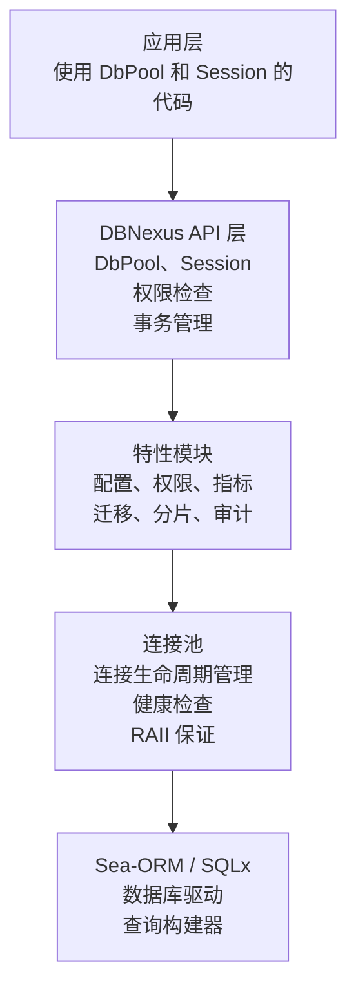
```mermaid
graph TD
    A[应用层<br/>使用 DbPool 和 Session 的代码] --> B[DBNexus API 层<br/>DbPool、Session<br/>权限检查<br/>事务管理]
    B --> C[特性模块<br/>配置、权限、指标<br/>迁移、分片、审计]
    C --> D[连接池<br/>连接生命周期管理<br/>健康检查<br/>RAII 保证]
    D --> E[Sea-ORM / SQLx<br/>数据库驱动<br/>查询构建器]
```

### 组件交互流程

1. **应用程序**从 `DbPool` 请求具有特定角色的会话
2. **DbPool** 验证角色并创建带有数据库连接的 `Session`
3. **Session** 处理所有数据库操作并进行自动权限检查
4. **权限系统**基于角色策略验证表访问
5. **连接**在会话被丢弃时自动返回到池中

### 关键实现细节

- **连接池**：使用 `AsyncMutex<Vec<DatabaseConnection>>` 配合原子计数器
- **权限缓存**：角色策略的 LRU 缓存以提高性能
- **健康检查**：后台任务定期验证空闲连接
- **RAII 管理**：会话丢弃时连接自动释放

---

## 模块架构

### 核心模块

#### 1. 配置模块 (`config.rs`)

**职责：**集中配置管理

**关键组件：**
```rust
pub struct DbConfig {
    pub url: String,                    // 数据库连接 URL
    pub max_connections: u32,           // 最大池大小
    pub min_connections: u32,           // 最小池大小
    pub idle_timeout: u64,              // 空闲连接超时
    pub acquire_timeout: u64,           // 连接获取超时
    pub permissions_path: Option<String>, // 权限配置路径
    pub migrations_dir: Option<PathBuf>, // 迁移目录
    pub auto_migrate: bool,             // 自动迁移标志
    pub migration_timeout: u64,         // 迁移超时
    pub admin_role: String,             // 管理员角色名称
}

pub struct DbConfigBuilder {
    // 链式 API 用于构建配置
}

pub struct ConfigCorrector {
    // 自动修正无效值
}
```

**配置源优先级：**
1. 环境变量（最高）
2. YAML/TOML 配置文件
3. 内置默认值（最低）

**安全特性：**
- 路径遍历攻击防护
- URL 协议白名单
- 配置验证

#### 2. 连接池模块 (`pool/`)

**职责：**管理数据库连接生命周期

**架构：**

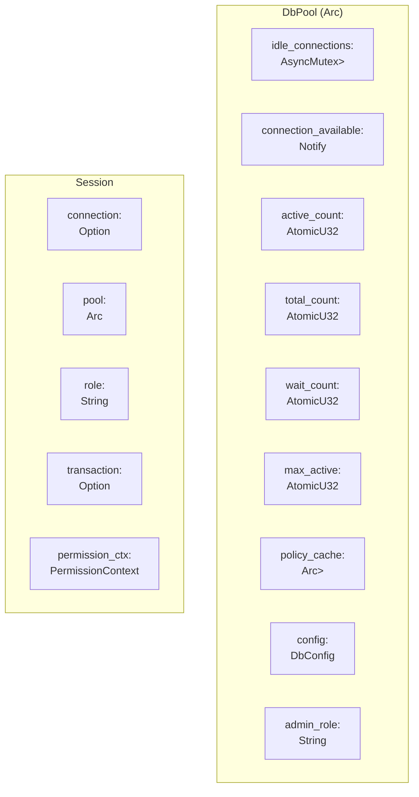
```mermaid
graph TD
    subgraph DbPool["DbPool (Arc<DbPoolInner>)"]
        idle_connections["idle_connections:<br/>AsyncMutex<Vec<DatabaseConnection>>"]
        connection_available["connection_available:<br/>Notify"]
        active_count["active_count:<br/>AtomicU32"]
        total_count["total_count:<br/>AtomicU32"]
        wait_count["wait_count:<br/>AtomicU32"]
        max_active["max_active:<br/>AtomicU32"]
        policy_cache["policy_cache:<br/>Arc<AsyncMutex<LruCache>>"]
        config["config:<br/>DbConfig"]
        admin_role["admin_role:<br/>String"]
    end

    subgraph Session["Session"]
        connection["connection:<br/>Option<DatabaseConnection>"]
        pool["pool:<br/>Arc<DbPool>"]
        role["role:<br/>String"]
        transaction["transaction:<br/>Option<DatabaseTransaction>"]
        permission_ctx["permission_ctx:<br/>PermissionContext"]
    end
```

**连接获取流程：**

```rust
async fn acquire_connection(&self) -> DbResult<DatabaseConnection> {
    // 1. 尝试从空闲队列获取
    let mut idle = self.idle_connections.lock().await;
    if let Some(conn) = idle.pop() {
        self.active_count.fetch_add(1, Ordering::SeqCst);
        return Ok(conn);
    }

    // 2. 检查是否达到最大连接数
    if self.total_count.load(Ordering::SeqCst) >= self.config.max_connections {
        drop(idle);
        self.wait_count.fetch_add(1, Ordering::SeqCst);
        let notified = self.connection_available.notified();
        notified.await; // 使用 Notify 高效等待
        // 重试...
    }

    // 3. 创建新连接
    let conn = self.create_connection().await?;
    self.total_count.fetch_add(1, Ordering::SeqCst);
    return Ok(conn);
}
```

**RAII 实现：**

```rust
impl Drop for Session {
    fn drop(&mut self) {
        if let Some(conn) = self.connection.take() {
            self.pool.release_connection(conn);
        }
    }
}
```

#### 3. 权限模块 (`permission.rs`)

**职责：**基于角色的访问控制（RBAC）

**架构：**

```
PermissionContext
├── role: String
├── policy_cache: Arc<AsyncMutex<LruCache<String, RolePolicy>>>
├── rate_limiter: Option<Arc<RateLimiter>>
└── config: PermissionConfig

PermissionConfig
└── roles: HashMap<String, RolePolicy>

RolePolicy
└── tables: Vec<TablePermission>

TablePermission
├── name: String (表名或 "*")
└── operations: HashSet<PermissionAction>
```

**权限检查流程：**

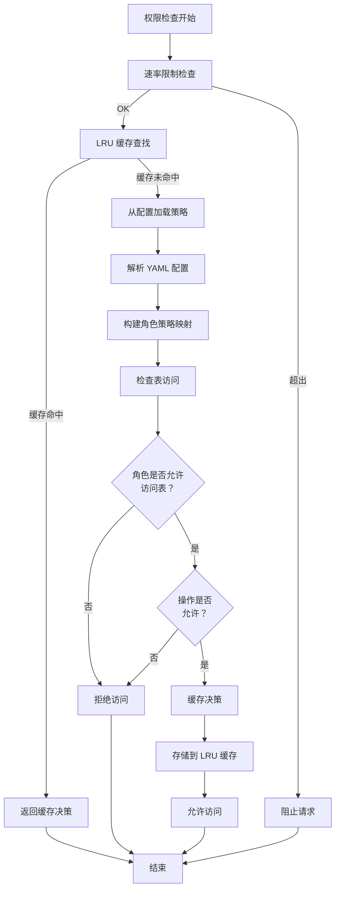
```mermaid
flowchart TD
    Start[权限检查开始] --> RateLimit[速率限制检查]
    RateLimit -->|超出| Block[阻止请求]
    RateLimit -->|OK| CacheLookup[LRU 缓存查找]

    CacheLookup -->|缓存命中| ReturnCached[返回缓存决策]
    CacheLookup -->|缓存未命中| LoadPolicy[从配置加载策略]

    LoadPolicy --> ParseYAML[解析 YAML 配置]
    ParseYAML --> BuildPolicy[构建角色策略映射]
    BuildPolicy --> CheckTable[检查表访问]

    CheckTable --> CheckRole{角色是否允许<br/>访问表？}
    CheckRole -->|否| Deny[拒绝访问]
    CheckRole -->|是| CheckOp{操作是否<br/>允许？}

    CheckOp -->|否| Deny
    CheckOp -->|是| CacheDecision[缓存决策]

    CacheDecision --> StoreCache[存储到 LRU 缓存]
    StoreCache --> Allow[允许访问]

    ReturnCached --> End[结束]
    Deny --> End
    Allow --> End
    Block --> End
```

**性能优化：**

- **LRU 缓存**：默认 256 个条目，减少配置加载
- **速率限制**：每分钟 100 个请求，防止滥用
- **异步锁**：并发请求的非阻塞

### 可选特性模块

#### 4. 指标模块 (`metrics.rs`)

**职责：**性能指标收集

**跟踪的指标：**

| 指标 | 描述 |
|---------|-------------|
| `pool_connections_active` | 当前活跃连接 |
| `pool_connections_idle` | 空闲连接 |
| `pool_connections_total` | 总连接数 |
| `query_latency_p50` | 第 50 百分位延迟 |
| `query_latency_p99` | 第 99 百分位延迟 |
| `query_throughput` | 每秒查询数 |

**数据结构：**

```rust
pub struct MetricsCollector {
    latency_histogram: LatencyHistogram,
    latency_percentiles: LatencyPercentiles,
    query_counter: AtomicU64,
    error_counter: AtomicU64,
}

pub struct LatencyPercentiles {
    p50: AtomicU64,
    p90: AtomicU64,
    p95: AtomicU64,
    p99: AtomicU64,
    p99_9: AtomicU64,
}
```

#### 5. 审计模块 (`audit.rs`)

**职责：**完整操作审计跟踪

**审计事件结构：**

```rust
pub struct AuditEvent {
    pub event_id: Uuid,
    pub timestamp: DateTime<Utc>,
    pub operation: AuditOperation,
    pub severity: AuditSeverity,
    pub result: AuditResult,
    pub table_name: Option<String>,
    pub record_id: Option<String>,
    pub user_role: Option<String>,
    pub sql_statement: Option<String>,
    pub error_message: Option<String>,
    pub execution_time_ms: Option<u64>,
}
```

**审计流程：**

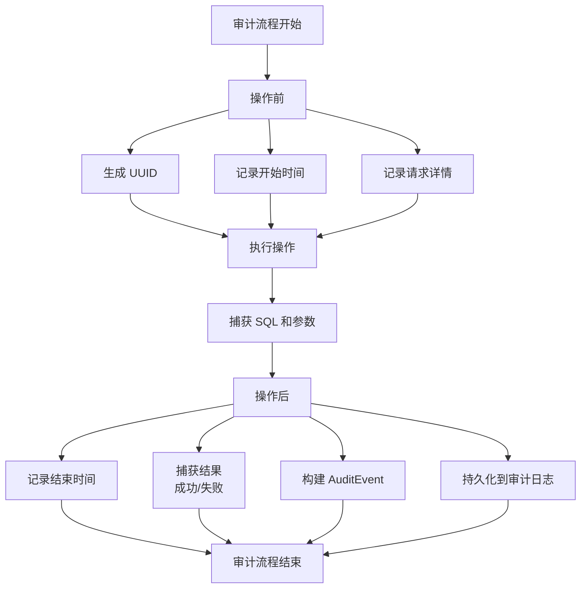
```mermaid
flowchart TD
    Start[审计流程开始] --> BeforeOp[操作前]

    BeforeOp --> GenUUID[生成 UUID]
    BeforeOp --> RecordStart[记录开始时间]
    BeforeOp --> LogDetails[记录请求详情]

    GenUUID --> ExecuteOp[执行操作]
    RecordStart --> ExecuteOp
    LogDetails --> ExecuteOp

    ExecuteOp --> CaptureSQL[捕获 SQL 和参数]

    CaptureSQL --> AfterOp[操作后]
    AfterOp --> RecordEnd[记录结束时间]
    AfterOp --> CaptureResult[捕获结果<br/>成功/失败]
    AfterOp --> BuildEvent[构建 AuditEvent]
    AfterOp --> Persist[持久化到审计日志]

    RecordEnd --> End[审计流程结束]
    CaptureResult --> End
    BuildEvent --> End
    Persist --> End
```

#### 6. 缓存模块 (`cache.rs`)

**职责：**实体数据缓存

**缓存架构：**

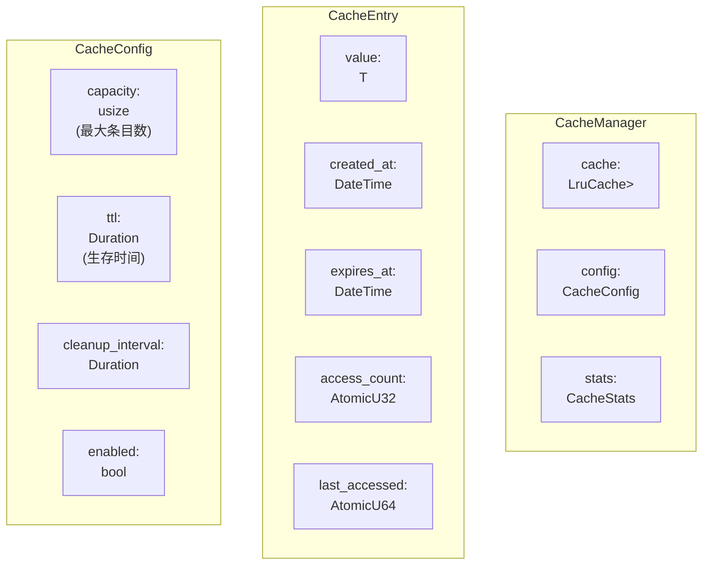
```mermaid
graph TD
    subgraph CacheManager["CacheManager<T>"]
        cache["cache:<br/>LruCache<CacheKey, CacheEntry<T>>"]
        config["config:<br/>CacheConfig"]
        stats["stats:<br/>CacheStats"]
    end

    subgraph CacheEntry["CacheEntry<T>"]
        value["value:<br/>T"]
        created_at["created_at:<br/>DateTime<Utc>"]
        expires_at["expires_at:<br/>DateTime<Utc>"]
        access_count["access_count:<br/>AtomicU32"]
        last_accessed["last_accessed:<br/>AtomicU64"]
    end

    subgraph CacheConfig["CacheConfig"]
        capacity["capacity:<br/>usize<br/>(最大条目数)"]
        ttl["ttl:<br/>Duration<br/>(生存时间)"]
        cleanup_interval["cleanup_interval:<br/>Duration"]
        enabled["enabled:<br/>bool"]
    end
```

**缓存策略：**

- **LRU 淘汰**：最近最少使用的条目首先被淘汰
- **TTL 过期**：条目在配置时间后过期
- **写透**：写入时更新缓存

#### 7. 分片模块 (`sharding.rs`)

**职责：**跨分片数据分布

**分片策略：**

```rust
pub enum ShardingStrategy {
    Yearly,    // 每年一个分片
    Monthly,    // 每月一个分片
    Daily,      // 每日一个分片
    Hash,       // 一致性哈希分片
}

pub trait ShardingStrategy: Send + Sync {
    fn get_shard_name(&self, timestamp: DateTime<Utc>) -> String;
    fn calculate_shard(&self, key: &str, total_shards: usize) -> usize;
}
```

**示例：月度分片**

```rust
impl ShardingStrategy for MonthlyStrategy {
    fn get_shard_name(&self, timestamp: DateTime<Utc>) -> String {
        format!("{}_{}", timestamp.year(), timestamp.month())
    }
}
```

#### 8. 全局索引模块 (`global_index.rs`)

**职责：**跨分片索引

**全局索引架构：**

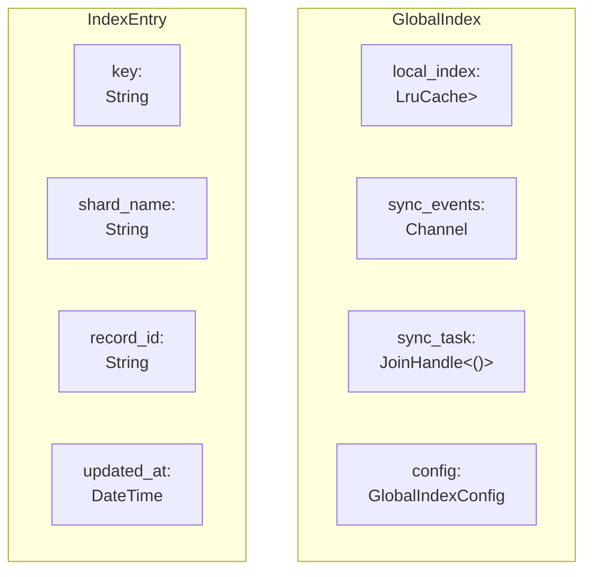
```mermaid
graph TD
    subgraph GlobalIndex["GlobalIndex"]
        local_index["local_index:<br/>LruCache<String, Vec<IndexEntry>>"]
        sync_events["sync_events:<br/>Channel<SyncEvent>"]
        sync_task["sync_task:<br/>JoinHandle<()>"]
        config["config:<br/>GlobalIndexConfig"]
    end

    subgraph IndexEntry["IndexEntry"]
        key["key:<br/>String"]
        shard_name["shard_name:<br/>String"]
        record_id["record_id:<br/>String"]
        updated_at["updated_at:<br/>DateTime<Utc>"]
    end
```

**同步流程：**

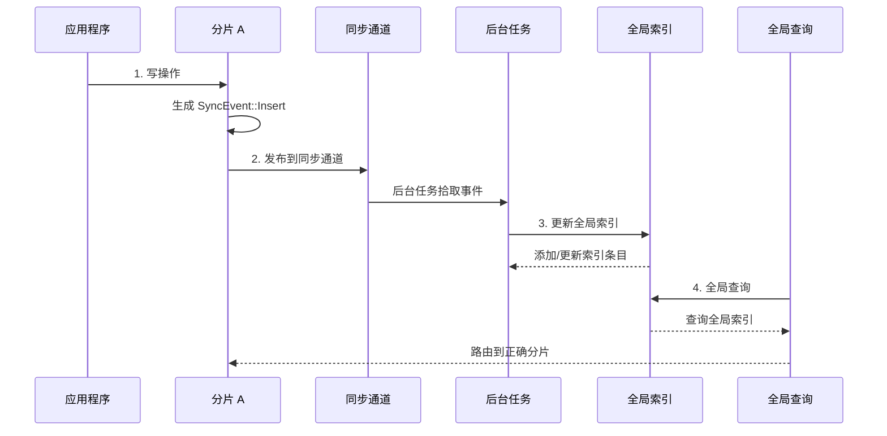
```mermaid
sequenceDiagram
    participant App as 应用程序
    participant ShardA as 分片 A
    participant Channel as 同步通道
    participant Task as 后台任务
    participant GlobalIdx as 全局索引
    participant Query as 全局查询

    App->>ShardA: 1. 写操作
    ShardA->>ShardA: 生成 SyncEvent::Insert
    ShardA->>Channel: 2. 发布到同步通道

    Channel->>Task: 后台任务拾取事件
    Task->>GlobalIdx: 3. 更新全局索引
    GlobalIdx-->>Task: 添加/更新索引条目

    Query->>GlobalIdx: 4. 全局查询
    GlobalIdx-->>Query: 查询全局索引
    Query-->>ShardA: 路由到正确分片
```

---

## 核心组件

### 1. 过程宏系统

**目的：**编译时代码生成以减少样板代码

**提供的宏：**

| 宏 | 目的 |
|--------|---------|
| `#[db_entity(...)]` | 统一的属性宏，将结构体映射到数据库表并生成 CRUD 方法、缓存、审计等功能 |

**宏扩展示例：**

**输入：**
```rust
#[db_entity(table_name = "users", primary_key = "id")]
#[derive(Clone, Debug, PartialEq, DeriveEntityModel)]
#[sea_orm(table_name = "users")]
struct User {
    #[sea_orm(primary_key)]
    id: i64,
    name: String,
}
```

**生成的代码（简化）：**
```rust
impl User {
    // CRUD 方法
    pub async fn insert(session: &Session, value: User) -> DbResult<User> { /* ... */ }
    pub async fn find_by_id(session: &Session, id: i64) -> DbResult<Option<User>> { /* ... */ }
    pub async fn update(session: &Session, value: User) -> DbResult<User> { /* ... */ }
    pub async fn delete(session: &Session, id: i64) -> DbResult<()> { /* ... */ }

    // 实体方法
    pub const TABLE_NAME: &str = "users";
    pub const PRIMARY_KEY: &str = "id";
}
```

### 2. SQL 解析器

**目的：**从 SQL 中提取操作类型和目标表

**支持的操作：**

```rust
pub enum SqlOperationType {
    Select,    // SELECT 查询
    Insert,    // INSERT 语句
    Update,    // UPDATE 语句
    Delete,    // DELETE 语句
    Ddl,       // CREATE/ALTER/DROP/TRUNCATE
    Dcl,       // GRANT/REVOKE
    Transaction, // BEGIN/COMMIT/ROLLBACK
    Other,      // 其他所有
}
```

**使用：**

```rust
let parser = SqlParser::new();
let (table_name, operation) = parser.parse_operation("SELECT * FROM users WHERE id = 1")?;

// 返回: ("users", SqlOperationType::Select)
```

### 3. 健康检查系统

**目的：**维护连接池健康

**架构：**

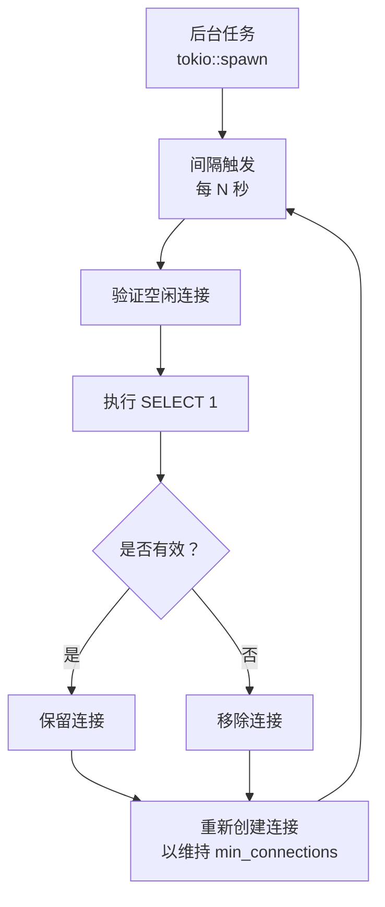
```mermaid
flowchart TD
    Start[后台任务<br/>tokio::spawn] --> Interval[间隔触发<br/>每 N 秒]

    Interval --> Validate[验证空闲连接]
    Validate --> Execute[执行 SELECT 1]
    Execute --> CheckValid{是否有效？}

    CheckValid -->|是| Keep[保留连接]
    CheckValid -->|否| Remove[移除连接]

    Keep --> Recreate[重新创建连接<br/>以维持 min_connections]
    Remove --> Recreate

    Recreate --> Interval
```

**健康检查实现：**

```rust
pub async fn validate_and_recreate_connections(&self) -> Result<u32, sea_orm::DbErr> {
    let mut invalid_count = 0;

    for conn in idle_connections.drain(..) {
        let is_valid = timeout(Duration::from_secs(2), conn.execute_raw("SELECT 1"))
            .await
            .is_ok_and(|result| result.is_ok());

        if is_valid {
            valid_connections.push(conn);
        } else {
            invalid_count += 1;
        }
    }

    // 重新创建以维持最小值
    let needed = min_connections - valid_connections.len();
    for _ in 0..needed {
        let new_conn = create_connection().await?;
        valid_connections.push(new_conn);
    }

    Ok(invalid_count)
}
```

---

## 数据流

### 查询流

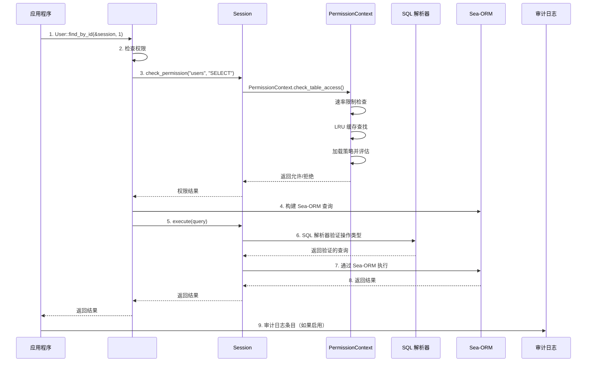
```mermaid
sequenceDiagram
    participant App as 应用程序
    participant CRUD as #[db_entity]
    participant Session as Session
    participant PermCtx as PermissionContext
    participant Parser as SQL 解析器
    participant SeaORM as Sea-ORM
    participant Audit as 审计日志

    App->>CRUD: 1. User::find_by_id(&session, 1)
    CRUD->>CRUD: 2. 检查权限
    CRUD->>Session: 3. check_permission("users", "SELECT")

    Session->>PermCtx: PermissionContext.check_table_access()
    PermCtx->>PermCtx: 速率限制检查
    PermCtx->>PermCtx: LRU 缓存查找
    PermCtx->>PermCtx: 加载策略并评估
    PermCtx-->>Session: 返回允许/拒绝

    Session-->>CRUD: 权限结果
    CRUD->>SeaORM: 4. 构建 Sea-ORM 查询
    CRUD->>Session: 5. execute(query)

    Session->>Parser: 6. SQL 解析器验证操作类型
    Parser-->>Session: 返回验证的查询

    Session->>SeaORM: 7. 通过 Sea-ORM 执行
    SeaORM-->>Session: 8. 返回结果
    Session-->>CRUD: 返回结果
    CRUD-->>App: 返回结果

    App->>Audit: 9. 审计日志条目（如果启用）
```

### 写流（带事务）

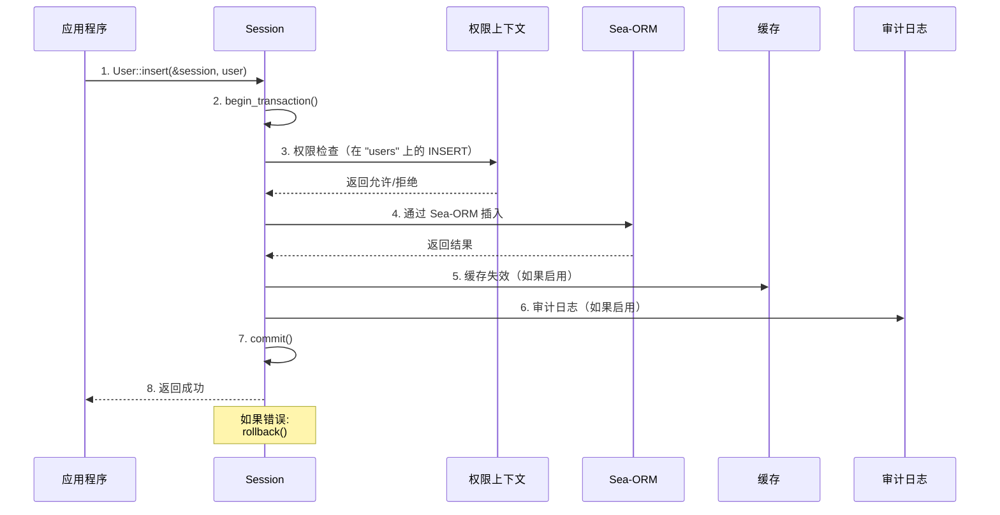
```mermaid
sequenceDiagram
    participant App as 应用程序
    participant Session as Session
    participant PermCtx as 权限上下文
    participant SeaORM as Sea-ORM
    participant Cache as 缓存
    participant Audit as 审计日志

    App->>Session: 1. User::insert(&session, user)
    Session->>Session: 2. begin_transaction()

    Session->>PermCtx: 3. 权限检查（在 "users" 上的 INSERT）
    PermCtx-->>Session: 返回允许/拒绝

    Session->>SeaORM: 4. 通过 Sea-ORM 插入
    SeaORM-->>Session: 返回结果

    Session->>Cache: 5. 缓存失效（如果启用）
    Session->>Audit: 6. 审计日志（如果启用）

    Session->>Session: 7. commit()
    Session-->>App: 8. 返回成功

    Note over Session: 如果错误:<br/>rollback()
```

---

## 安全架构

### 纵深防御

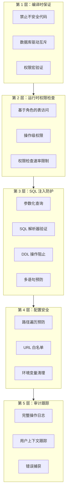
```mermaid
graph TD
    subgraph Layer1["第 1 层：编译时保证"]
        Unsafe[禁止不安全代码]
        DriverMutual[数据库驱动互斥]
        PermMacro[权限宏验证]
    end

    subgraph Layer2["第 2 层：运行时权限检查"]
        RoleAccess[基于角色的表访问]
        OpPerm[操作级权限]
        RateLimit[权限检查速率限制]
    end

    subgraph Layer3["第 3 层：SQL 注入防护"]
        ParamQueries[参数化查询]
        SQLParser[SQL 解析器验证]
        DDLBlock[DDL 操作阻止]
        MultiStmt[多语句预防]
    end

    subgraph Layer4["第 4 层：配置安全"]
        PathPrev[路径遍历预防]
        URLWhitelist[URL 白名单]
        EnvSanitize[环境变量清理]
    end

    subgraph Layer5["第 5 层：审计跟踪"]
        OpLog[完整操作日志]
        UserTrack[用户上下文跟踪]
        ErrorCapture[错误捕获]
    end

    Layer1 --> Layer2
    Layer2 --> Layer3
    Layer3 --> Layer4
    Layer4 --> Layer5
```

### 权限模型

```mermaid
graph TD
    subgraph PermConfig["权限配置 (YAML)"]
        Roles[角色]
    end

    subgraph Admin["admin"]
        AdminTables[表: *<br/>所有操作]
    end

    subgraph Manager["manager"]
        ManagerTables[表: users, orders]
        ManagerOps[操作: SELECT, INSERT, UPDATE]
    end

    subgraph User["user"]
        UserTables[表: users]
        UserOps[操作: SELECT]
    end

    Roles --> Admin
    Roles --> Manager
    Roles --> User

    Admin --> AdminTables
    Manager --> ManagerTables
    ManagerTables --> ManagerOps
    User --> UserTables
    UserTables --> UserOps

    subgraph Algorithm["权限检查算法"]
        Step1[1. 从会话获取角色]
        Step2[2. 查找角色策略<br/>（或使用缓存）]
        Step3{3. 是 "*"？}
        Step4[3a. 授予所有访问]
        Step5[3b. 检查操作列表]
        Step6[4. 对于特定表：<br/>检查操作列表]
        Step7[5. 返回允许/拒绝]
    end

    Step1 --> Step2
    Step2 --> Step3
    Step3 -->|是| Step4
    Step3 -->|否| Step5
    Step5 --> Step6
    Step4 --> Step7
    Step6 --> Step7
```

---

## 性能架构

### 零成本抽象

```rust
// 特性门控编译
#[cfg(feature = "metrics")]
pub fn track_metric(&self, name: &str, value: u64) {
    // 指标代码
}

#[cfg(not(feature = "metrics"))]
pub fn track_metric(&self, name: &str, value: u64) {
    // 无操作 - 编译时移除
}
```

### 无锁计数器

```rust
pub struct PoolStatus {
    pub total: AtomicU32,      // 无锁
    pub active: AtomicU32,     // 无锁
    pub wait_count: AtomicU32,  // 无锁
}
```

### 异步操作

- 所有 I/O 使用 `async/await`
- `AsyncMutex` 用于保护共享状态
- `Notify` 而不是条件变量（避免忙等待）

### 连接池

```
策略: 池 + LRU

优势:
├── 重用连接（避免 TCP 握手）
├── 限制最大连接（防止耗尽）
├── 维持最小值（避免冷启动）
└── 健康检查（移除死连接）
```

---

## 可扩展性架构

### 水平扩展（分片）

```mermaid
flowchart TD
    App[应用程序] --> ShardRouter[分片路由器]

    ShardRouter --> Yearly[年度策略]
    ShardRouter --> Monthly[月度策略]
    ShardRouter --> Hash[哈希策略]

    Yearly --> Shard2024[shard_2024]
    Monthly --> Shard2024_01[shard_2024_01]
    Hash --> ShardHash[shard_{hash key % N}]

    App --> QueryRouting[查询路由]
    QueryRouting --> GlobalIndex[全局索引<br/>可选]
    GlobalIndex --> Route[路由到正确分片]
```

### 垂直扩展（缓存）

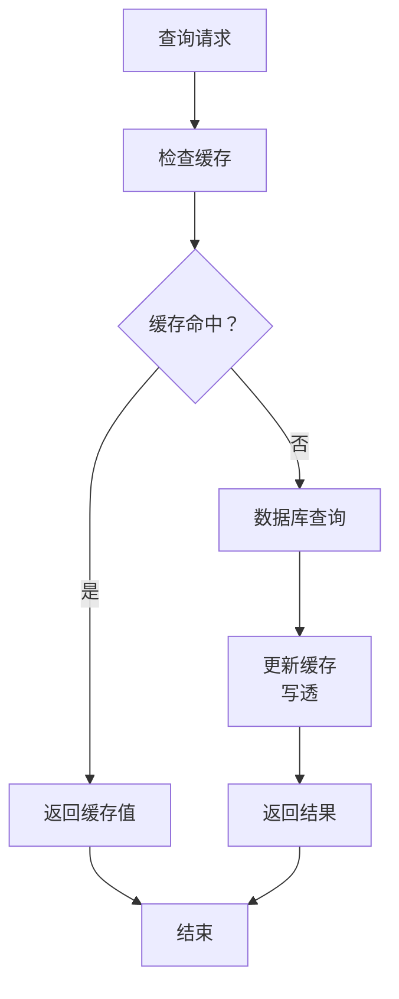
```mermaid
flowchart TD
    Start[查询请求] --> CheckCache[检查缓存]

    CheckCache --> Hit{缓存命中？}
    Hit -->|是| ReturnCached[返回缓存值]
    Hit -->|否| DBQuery[数据库查询]

    DBQuery --> UpdateCache[更新缓存<br/>写透]
    UpdateCache --> ReturnDB[返回结果]

    ReturnCached --> End[结束]
    ReturnDB --> End
```

### 基于特性的扩展

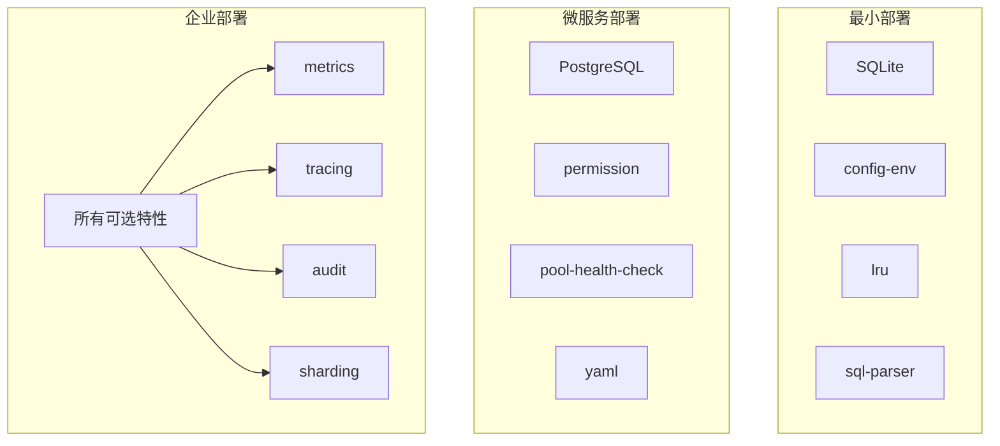
```mermaid
graph TD
    subgraph Minimal["最小部署"]
        SQLite[SQLite]
        config_env[config-env]
        lru[lru]
        sql_parser[sql-parser]
    end

    subgraph Microservice["微服务部署"]
        PostgreSQL[PostgreSQL]
        permission[permission]
        pool_health_check[pool-health-check]
        config_yaml[yaml]
    end

    subgraph Enterprise["企业部署"]
        AllFeatures[所有可选特性]
        metrics[metrics]
        tracing[tracing]
        audit[audit]
        sharding[sharding]
    end

    AllFeatures --> metrics
    AllFeatures --> tracing
    AllFeatures --> audit
    AllFeatures --> sharding
```

---

## 结论

DBNexus 架构设计具有：

1. **模块化** - 清晰的关注点分离，特性门控
2. **安全性** - RAII、编译时保证、无不安全代码
3. **性能** - 异步优先、尽可能无锁、高效池化
4. **安全性** - 多层防御、RBAC、审计跟踪
5. **可扩展性** - 可插拔组件、基于 trait 的设计
6. **可观测性** - 指标、跟踪、内置审计日志

这种架构使 DBNexus 能够从嵌入式设备扩展到企业部署，同时保持简单性和人体工程学。

更多组件细节，请参见：
- [API 参考](API_REFERENCE.md)
- [用户指南](USER_GUIDE.md)
- [Rust 文档](https://docs.rs/dbnexus)
