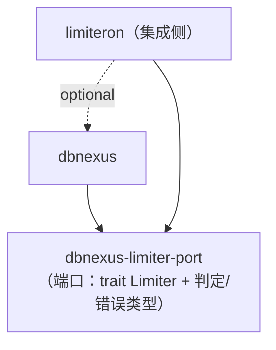

# 限流统一迁移指南（Limiter 端口 / limiteron 后端）

> 适用版本：dbnexus 0.6.0-rc.6+（R-dbnexus-003 限流统一）

## 背景

dbnexus 的权限检查链路（`PermissionContext::check_table_access`）内置了令牌桶
限流器（`RateLimiter`）。roadmap R2 要求接入 limiteron 作为可选限流后端，但存在
一个硬约束：

- limiteron 已 **optional 依赖 dbnexus**（其 `postgres`/`sqlite`/`mysql` 存储
  feature 经 dbnexus 驱动做配额/封禁持久化）；
- Cargo **禁止包级循环依赖（optional 亦然）**——dbnexus 一旦反向依赖 limiteron
  （直接或经任何中间 crate 传递），启用 limiteron 存储特性的组合就会成环。

因此唯一可行路径是**层级/端口抽取**：限流端口 `Limiter` 独立为小 crate
`dbnexus-limiter-port`（本仓库 `limiter-port/`，仅依赖 `async-trait`，
不依赖 dbnexus 与 limiteron 任何一方），
dbnexus 与 limiteron 各自单向依赖端口，装配发生在应用组合根：



> 虚线：limiteron 既有的存储依赖（方向不变）。

经全图解析验证（`cargo metadata` 循环检测）：不含 dbnexus 与
dbnexus-limiter-port 参与的任何依赖环。

## 端口契约

```rust
#[async_trait]
pub trait Limiter: Send + Sync {
    /// 检查 key（角色/用户/IP）是否允许通过，并消费一次配额
    async fn check(&self, key: &str) -> Result<RateLimitDecision, RateLimitError>;
}

pub struct RateLimitDecision {
    pub allowed: bool,
    /// HTTP 429 Retry-After 语义；None = 后端未提供
    pub retry_after: Option<Duration>,
}
```

- `async_trait` 保证对象安全，`Arc<dyn Limiter>` 可注入（与 limiteron 自身
  `limiters::Limiter` 的 async_trait 模式一致）；
- 后端故障经 `Err(RateLimitError)` 显性上报，端口不擅自放行或拒绝。

## 双后端切换

`PermissionContext::with_cache_size_and_backend` 是后端选择入口：

```rust
use dbnexus::access::{PermissionContext, RateLimitBackend};

// 1. 内置令牌桶（默认后端，行为与 0.6.0-rc.5 完全一致）
let ctx = PermissionContext::with_cache_size_and_backend(
    "admin".into(), 4096,
    RateLimitBackend::TokenBucket { max_requests: 100, window_secs: 60 },
).await?;

// 2. 外部端口实现注入（limiteron 适配器等）
let ctx = PermissionContext::with_cache_size_and_backend(
    "admin".into(), 4096,
    RateLimitBackend::External(Arc::new(my_limiteron_adapter)),
).await?;
```

既有构造器（`new_default_with_rate_limit`、`with_cache_size_and_rate_limit` 等）
行为不变——默认仍装配令牌桶。

### limiteron 适配器接线（组合根示例）

dbnexus 不直接依赖 limiteron（防环）。limiteron 侧未来可仿照其
`integrations/limiteron-sdforge` 模式发布 `limiteron-dbnexus` 集成 crate 实现
端口；在此之前，应用组合根可自写薄适配器：

```rust,ignore
struct LimiteronAdapter { limiter: limiteron::limiters::TokenBucket }

#[async_trait]
impl dbnexus::Limiter for LimiteronAdapter {
    async fn check(&self, key: &str) -> Result<RateLimitDecision, RateLimitError> {
        self.limiter
            .allow(key, 1).await
            .map(|allowed| if allowed { RateLimitDecision::allow() }
                            else { RateLimitDecision::deny(None) })
            .map_err(|e| RateLimitError::new(e.to_string()))
    }
}
```

## 429 响应语义

权限检查的限流拒绝与策略拒绝此前不可区分（均为 `false`）。现引入
`TableAccessDecision`：

- `Allowed` — 允许；
- `Denied` — 策略拒绝（403 语义）；
- `RateLimited { retry_after }` — 限流拒绝（429 语义，携带 Retry-After 建议）。

会话层（`Session::check_permission` 及全部执行路径）经统一的
`check_table_or_error` 映射：`Denied → DbError::Permission`（不变），
`RateLimited → DbError::RateLimited { retry_after_secs }`。HTTP 层可将
`DbError::RateLimited` 映射为 429 + `Retry-After` 响应头；统一错误码
`ErrorCode::RateLimited = 2002`。

旧布尔 API `check_table_access` 保留：两种拒绝均返回 `false`，行为兼容。

### 故障语义

限流后端 `check` 返回 `Err` 时 **fail-closed**：按限流拒绝处理（计入
`rate_limited_checks` 统计 + `log::warn` 显性记录），绝不静默放行；
此时 `retry_after = None`。

## 审计事件

`audit` feature 下可为上下文挂载审计器，限流拒绝即产生审计事件：

```rust,ignore
let mut ctx = PermissionContext::with_cache_size_and_backend(/* ... */).await?;
ctx.set_audit_logger(Arc::new(audit_logger));
```

事件形态：`entity_type = "table_access"`、`entity_id = 表名`、
`operation = rate_limit_exceeded`、`result = Failure`、`severity = Medium`，
`extra` JSON 携带 `operation`（SQL 动作）与 `retry_after_secs`。审计写入失败
不阻断权限判定，但经 `log::warn` 显性记录。

## Feature 与依赖

- 新 workspace 成员 `limiter-port`（crate 名 `dbnexus-limiter-port`，零
  feature、仅 `async-trait`）；
- `permission` feature 新增 `dep:dbnexus-limiter-port`（端口随权限模块可用；
  未启用 permission 时零额外依赖）；
- 旧令牌桶保留为默认可选后端，未移除任何公开 API。

## 从 0.6.0-rc.5 迁移

| 场景 | rc.5 | rc.6+ | 动作 |
| --- | --- | --- | --- |
| 默认令牌桶限流 | 自动装配 | 自动装配（不变） | 无 |
| 调整令牌桶参数 | `with_cache_size_and_rate_limit` | 不变 | 无 |
| 接入 limiteron 等外部后端 | 不可行（会成环） | `with_cache_size_and_backend` + `External(Arc<dyn Limiter>)` | 实现端口后注入 |
| 区分 429/403 | 不可区分（均 `false`） | `check_table_access_decision` | 会话层已自动返回 `DbError::RateLimited` |
| 限流审计 | 无 | `set_audit_logger`（audit feature） | 按需挂载 |
